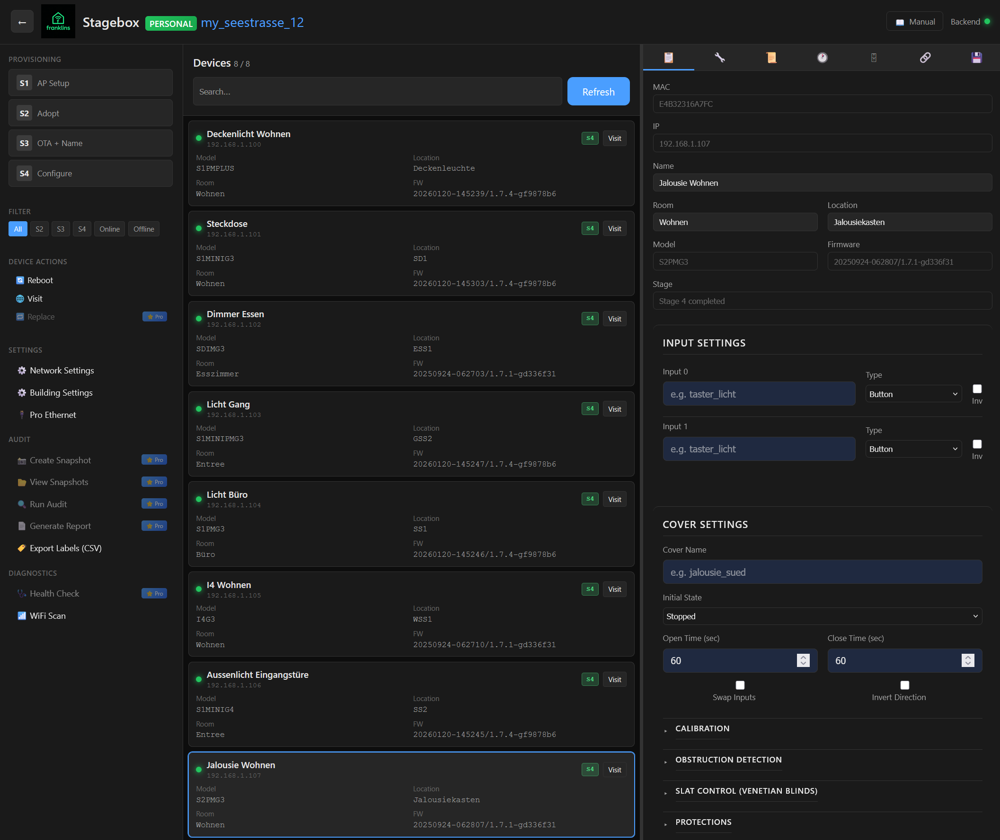
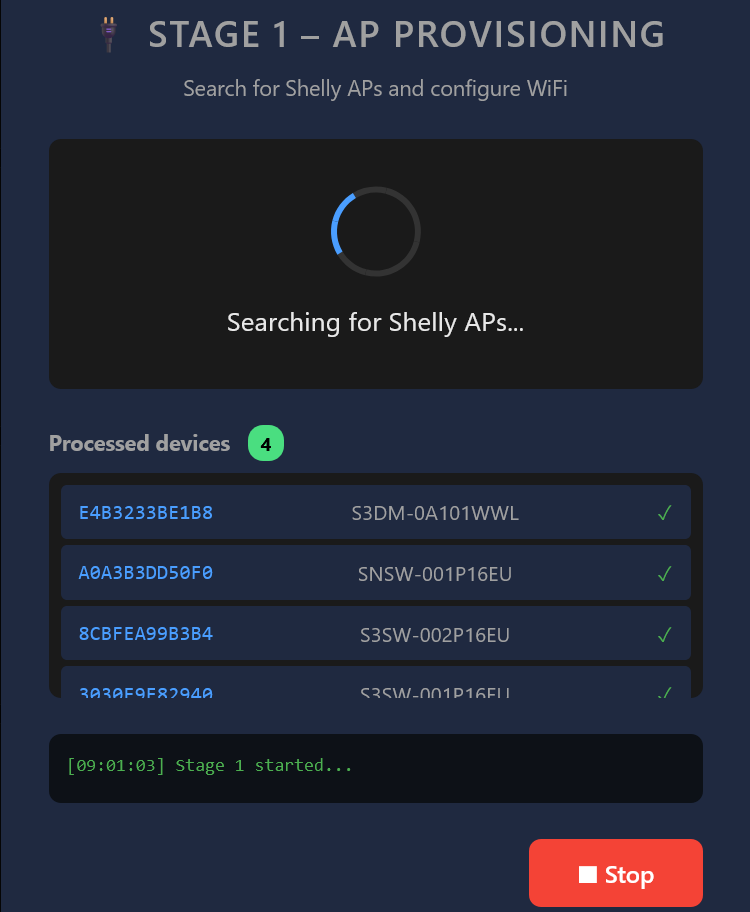
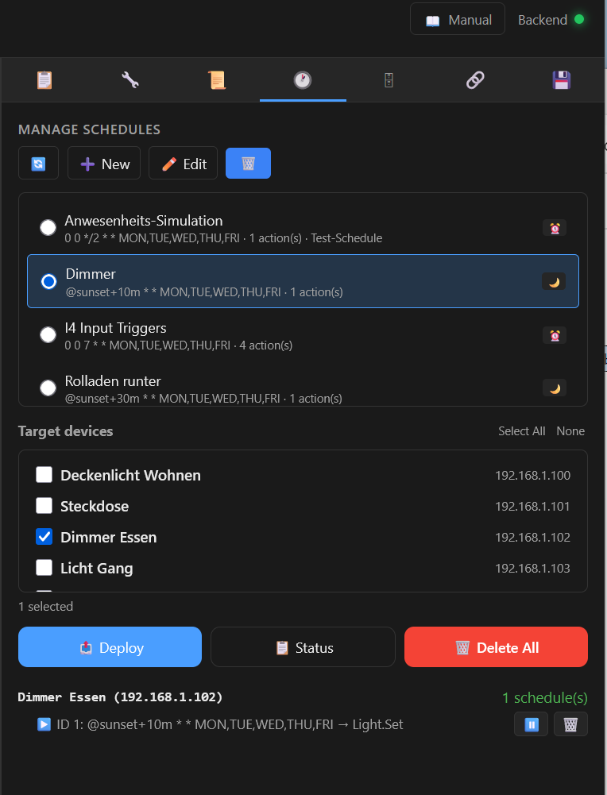
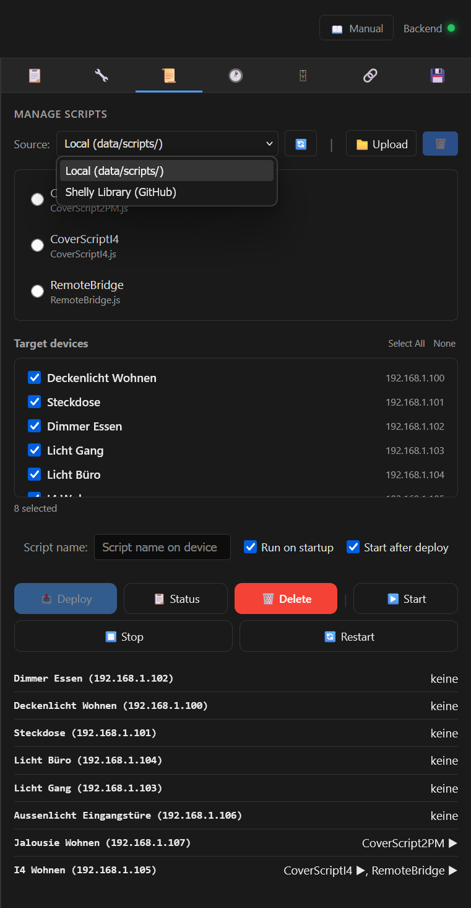

# Stagebox – Shelly Bulk Provisioning & Configuration Tool

> Provision, configure, and manage dozens of Shelly Gen2+ devices from a single web interface – no SSH, no CLI, no cloud required.

Stagebox runs on a Raspberry Pi and guides you through a **4-stage workflow**: discover → adopt → configure → deploy. Built for electricians, installers, and makers who need to set up Shelly devices efficiently at scale.

[](https://www.gnu.org/licenses/gpl-3.0)

---

## What it does

<!-- Replace with your actual screenshot paths after uploading to docs/images/ -->
<!-- TIP: You can also drag & drop images into a GitHub Issue to get a hosted URL -->

|  |  |
|:--:|:--:|
| **Dashboard** – All devices at a glance | **Stage 1** – Discover Shellys in AP mode |

|  |  |
|:--:|:--:|
| **Schedules** – Configure & deploy schedules | **Script Pool** – Upload & manage scripts |

---

## The 4-Stage Workflow

**Stage 1 – Discover:** Stagebox scans for Shelly devices in AP mode via WiFi and lists them automatically.

**Stage 2 – Adopt:** Connect discovered devices to your target network with one click.

**Stage 3 – Name & Update:** Assign meaningful names, update firmware to the latest version.

**Stage 4 – Configure:** Apply settings, upload scripts, set up webhooks, configure KVS – all from the web UI.

After provisioning, manage your entire fleet: restart devices, check status, push firmware updates, and replace defective units.

---

## Key Features

- **Web-based UI** – No SSH, no command line, works from any browser
- **Bulk provisioning** – Set up 5 or 50 devices with the same workflow
- **Script management** – Upload, deploy, and manage Shelly scripts across devices
- **KVS & Webhooks** – Full configuration without touching the Shelly web UI
- **Firmware updates** – OTA updates for all devices from one place
- **MQTT configuration** – Enable and configure MQTT broker settings
- **Multi-language** – English, German, French, Italian, Dutch
- **Offline-capable** – Runs entirely on your local network

---

## Quick Start

### Option 1: SD Card Image (Recommended)

1. Download the latest image from [**Releases**](https://github.com/franklins59/stagebox/releases)
2. Flash it to an SD card (e.g. with [Raspberry Pi Imager](https://www.raspberrypi.com/software/))
3. Boot your Raspberry Pi
4. Open `http://<raspberry-pi-ip>:5000` in your browser
5. Start provisioning

### Option 2: Manual Installation

```bash
git clone https://github.com/franklins59/stagebox.git
cd stagebox
pip install -r requirements.txt --break-system-packages
cp data/config.yaml.example data/config.yaml
cp data/secrets.yaml.example data/secrets.yaml
python3 -m web
```

## Requirements

- Raspberry Pi 4 or 5
- Raspberry Pi OS Bookworm (64-bit)
- Python 3.11+
- Ethernet connection recommended (WiFi used for Shelly discovery)

---

## Configuration

Edit `data/config.yaml` for your network:

```yaml
network:
  wifi_ssid: "YourNetwork"
  wifi_password: "YourPassword"
  ip_range_start: "192.168.1.100"
  ip_range_end: "192.168.1.200"
```

Full documentation in [docs/manual/](docs/manual/) (DE, EN, FR, IT, NL).

---

## Personal vs. Pro Edition

Stagebox Personal is **free and open source**. For professional installers, Stagebox Pro adds multi-building management, snapshots, audits, and comes as a ready-to-use hardware kit.

| | Personal | Pro |
|---|:---:|:---:|
| **Unlimited devices** | ✅ | ✅ |
| **4-stage provisioning** | ✅ | ✅ |
| **Script & webhook management** | ✅ | ✅ |
| **Firmware updates** | ✅ | ✅ |
| **Multi-language UI** | ✅ | ✅ |
| **Multiple buildings/projects** | — | ✅ |
| **Snapshots & audits** | — | ✅ |
| **USB backup & restore** | — | ✅ |
| **Pre-configured hardware** | — | ✅ |
| **Label export** | — | ✅ |
| **Price** | **Free** | **CHF 480** |

→ [**Stagebox Pro details & shop**](https://franklins.forstec.ch)

---

## Updates

Stagebox Personal receives updates directly from this repository. Check for updates in the web interface under **System → Updates**.

---

## Contributing

Found a bug or have a feature request? Open an [Issue](https://github.com/franklins59/stagebox/issues) or start a [Discussion](https://github.com/franklins59/stagebox/discussions).

---

## License

Licensed under the [GNU General Public License v3.0](https://www.gnu.org/licenses/gpl-3.0.html). Free to use, modify, and distribute – derivative works must remain GPL-3.0.

---

Made with ❤️ by [franklin](https://franklins.forstec.ch) in Switzerland