# Stagebox Web-UI User Manual

> *This manual reflects Stagebox Pro Version 1.2.0*

## Part 1: Getting Started

This guide walks you through the initial setup of your Stagebox and creating your first building project.
  


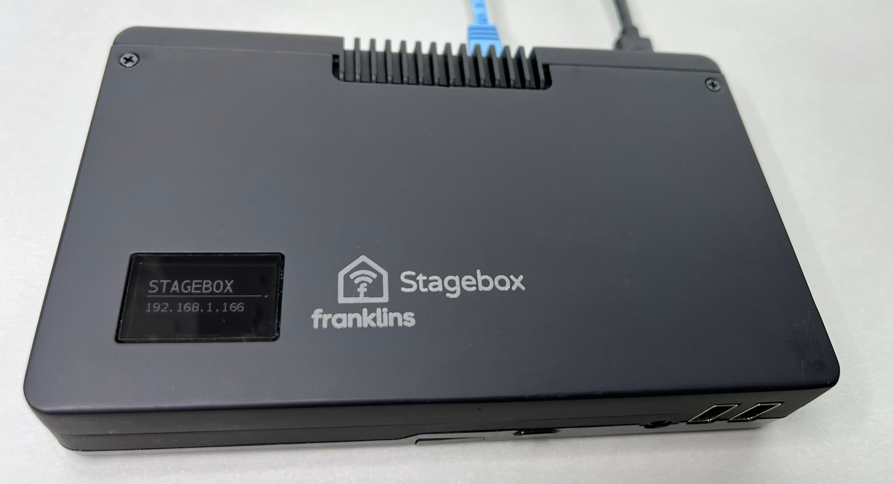

### 1.1 Connecting the Stagebox

1. Connect the Stagebox to your network using an Ethernet cable
2. Connect the power supply
3. Wait approximately 60 seconds for the system to boot
4. The OLED display on the front will show connection information

> **Note:** The Stagebox requires a wired network connection. WiFi is used only for provisioning Shelly devices.

<div style="page-break-before: always;"></div>

### 1.2 Using the OLED Display

The Stagebox features a built-in OLED display that rotates through several information screens automatically (every 10 seconds).

**Screen 1 - Splash (Main Identification):**

```
┌────────────────────────────┐
│                            │
│   ███ STAGEBOX ███         │
│                            │
│ ────────────────────────── │
│                            │
│   192.168.1.100            │
│                            │
│   A1:B2:C3                 │
│                            │
└────────────────────────────┘
```

This screen shows:
- "STAGEBOX" title
- IP address for web access
- MAC suffix (last 6 characters for identification)

**Screen 2 - Building Info:**
- Current Stagebox version
- Active building name

**Screen 3 - System Status:**
- CPU temperature and load
- NVMe temperature
- RAM and disk usage

**Screen 4 - Network:**
- Ethernet IP address
- WLAN IP address (if connected)
- Hostname

**Screen 5 - Clock:**
- Current time with seconds
- Current date

<div style="page-break-before: always;"></div>

**OLED Button Functions:**

The button on the Argon ONE case controls the display:

| Press Duration | Action |
|----------------|--------|
| Short press (<2s) | Switch to next screen |
| Long press (2-10s) | Toggle display on/off |
| Very long press (10s+) | Reset Admin PIN to `0000` |

> **Tip:** Use the Splash or Network screen to find the IP address needed to access the Web-UI.

<div style="page-break-before: always;"></div>

### 1.3 Accessing the Web Interface

Find the IP address on the OLED display (Splash or Network screen), then open a web browser and navigate to:

```
http://<IP-ADDRESS>:5000
```

For example: `http://192.168.1.100:5000`

**Alternative using hostname:**

```
http://stagebox-XXXXXX.local:5000
```

Replace `XXXXXX` with the MAC suffix shown on the OLED display.

> **Note:** The `.local` hostname requires mDNS support (Bonjour). If it doesn't work, use the IP address directly.

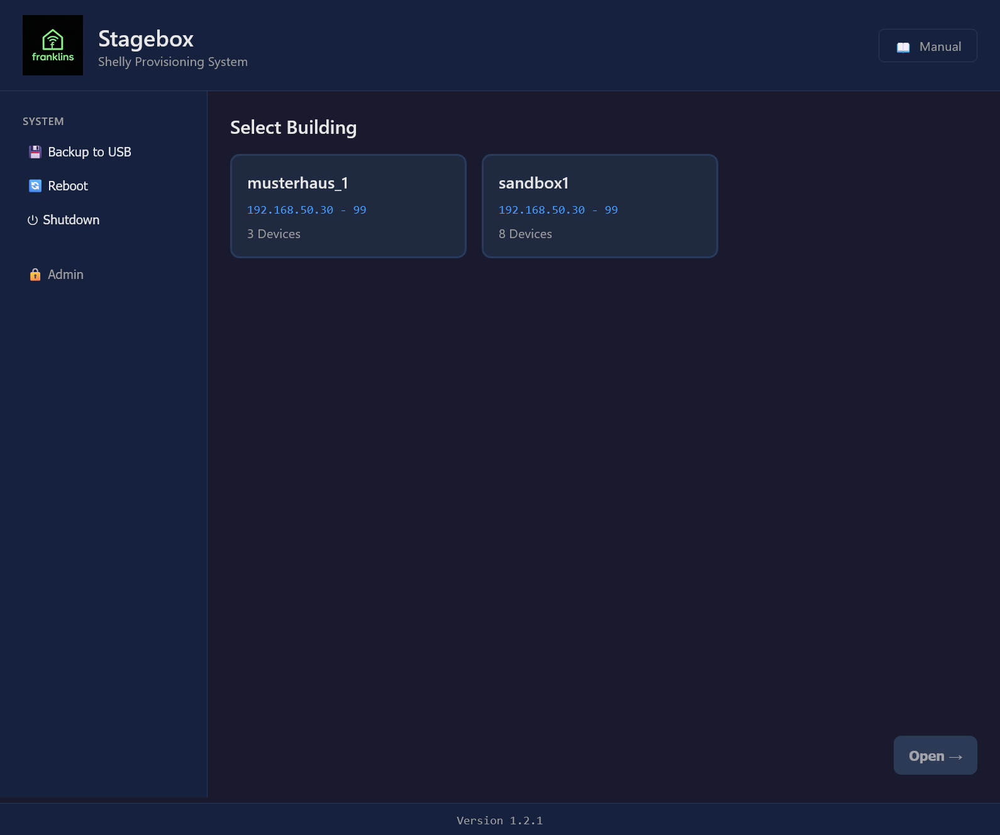
<div style="page-break-before: always;"></div>
### 1.4 Logging in as Admin

Administrative functions are protected by a PIN. The default PIN is **0000**.

1. Click **🔒 Admin** in the Admin section
2. Enter the PIN (default: `0000`)
3. Click **Confirm**

You are now logged in as Admin (shown as 🔓 Admin).

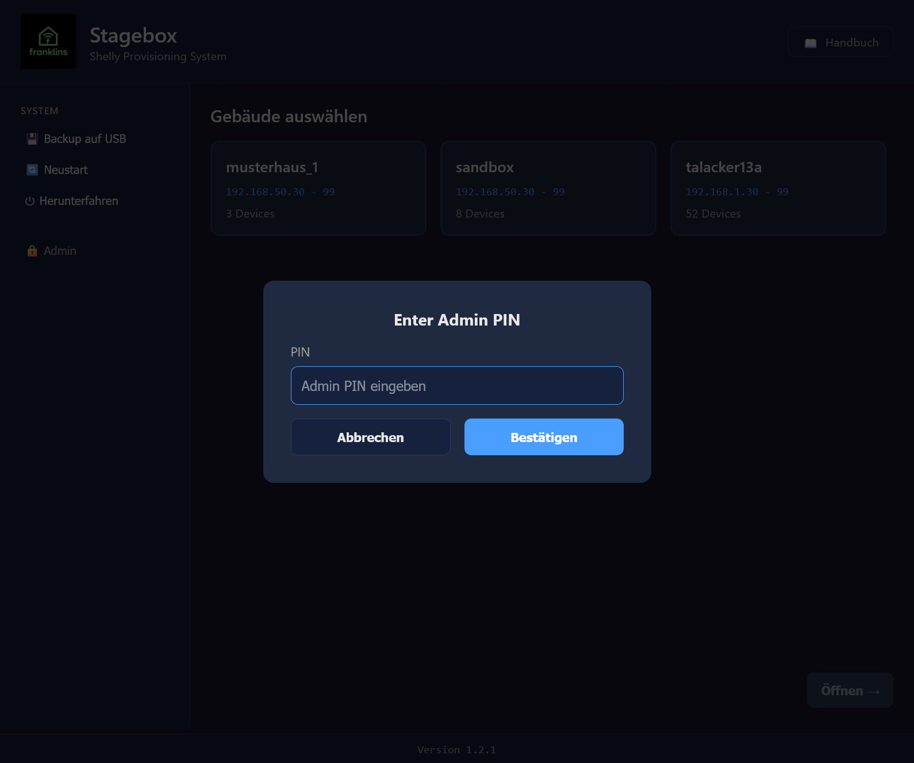

> **Security Recommendation:** Change the default PIN immediately after first login (see section 1.7).
<div style="page-break-before: always;"></div>

### 1.5 Creating Your First Building

A "building" in Stagebox represents a project or installation site. Each building has its own device database, IP pool, and configuration.

1. Ensure you're logged in as Admin (🔓 Admin visible)
2. Click **➕ New Building**
3. Enter a building name (e.g., `customer_house`)
   - Use lowercase letters, numbers, and underscores only
   - Spaces and special characters are automatically converted
4. Click **Create**

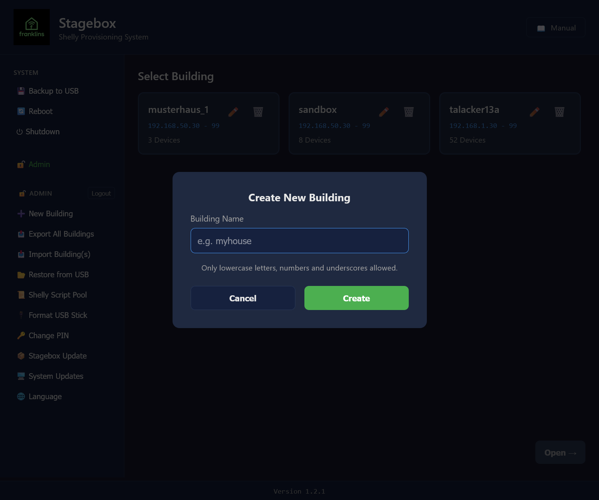

The building is created and **automatically opens** with the WiFi configuration dialog.

---

> ⚠️ **CRITICAL: Configure WiFi Settings Correctly!**
>
> The WiFi settings you enter here determine which network your Shelly devices will connect to. **Incorrect settings will make devices unreachable!**
>
> - Double-check SSID spelling (case-sensitive!)
> - Verify password is correct
> - Ensure IP ranges match your actual network
>
> Devices provisioned with wrong WiFi credentials must be factory reset and reprovisioned.

<div style="page-break-before: always;"></div>

### 1.6 Configuring WiFi and IP Ranges

After creating a building, the **Building Settings** dialog appears automatically.

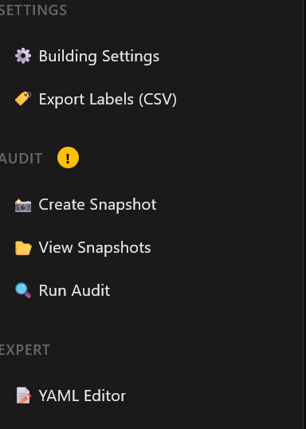

#### WiFi Configuration

Enter the WiFi credentials that Shelly devices should connect to:

**Primary WiFi (required):**
- SSID: Your network name (e.g., `HomeNetwork`)
- Password: Your WiFi password

**Fallback WiFi (optional):**
- A backup network if the primary is unavailable

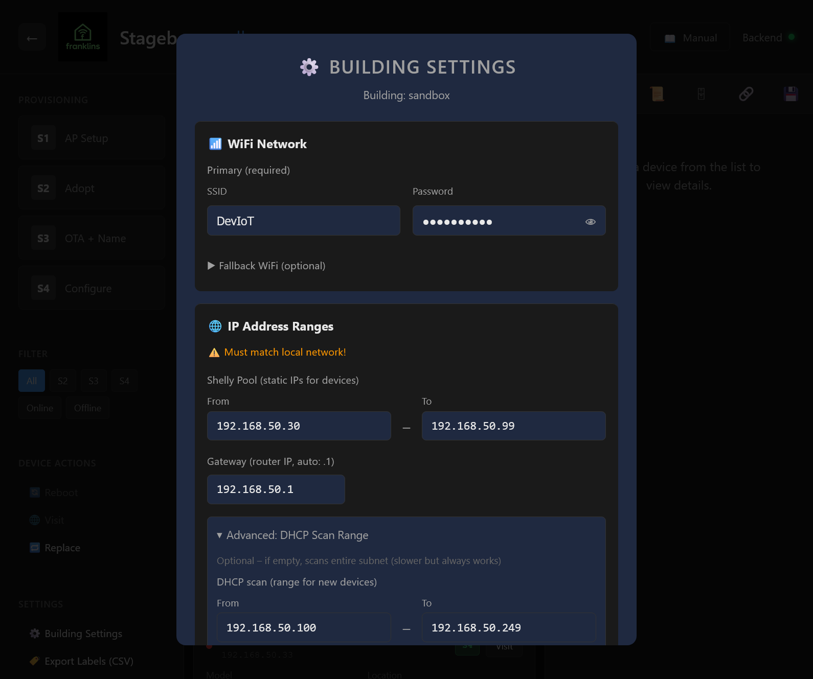

#### IP Address Ranges

Configure the static IP pool for Shelly devices:

**Shelly Pool:**
- From: First IP for devices (e.g., `192.168.1.50`)
- To: Last IP for devices (e.g., `192.168.1.99`)

**Gateway:**
- Usually your router IP (e.g., `192.168.1.1`)
- Leave empty for auto-detection (.1)

**DHCP Scan Range (optional):**
- Range where new devices appear after factory reset
- Leave empty to scan entire subnet (slower)

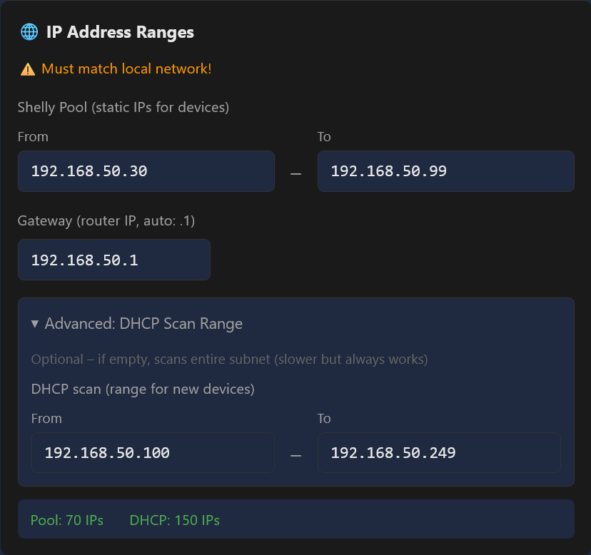

> **Warning:** The IP ranges must match your actual network! Devices will be unreachable if configured with wrong subnet.

5. Click **💾 Save**

<div style="page-break-before: always;"></div>

### 1.7 Changing the Admin PIN

To change your Admin PIN (default is `0000`):

1. Click **🔓 Admin** (must be logged in)
2. Click **🔑 Change PIN**
3. Enter the new PIN (minimum 4 digits)
4. Confirm the new PIN
5. Click **Save**

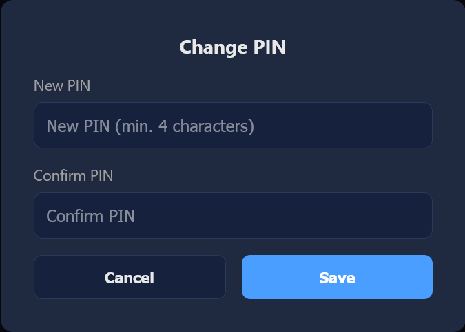

> **Important:** Remember this PIN! It protects all administrative functions including building deletion and system settings.

### 1.8 Next Steps

Your Stagebox is now ready for device provisioning. Continue to Part 2 to learn about:
- Provisioning new Shelly devices (Stage 1-4)
- Managing devices
- Creating backups

---

<div style="page-break-before: always;"></div>

## Part 2: Function Reference

### 2.1 Greeting Page (Building Selection)

The Greeting Page is the starting point after accessing the Stagebox. It shows all buildings and provides system-wide functions.

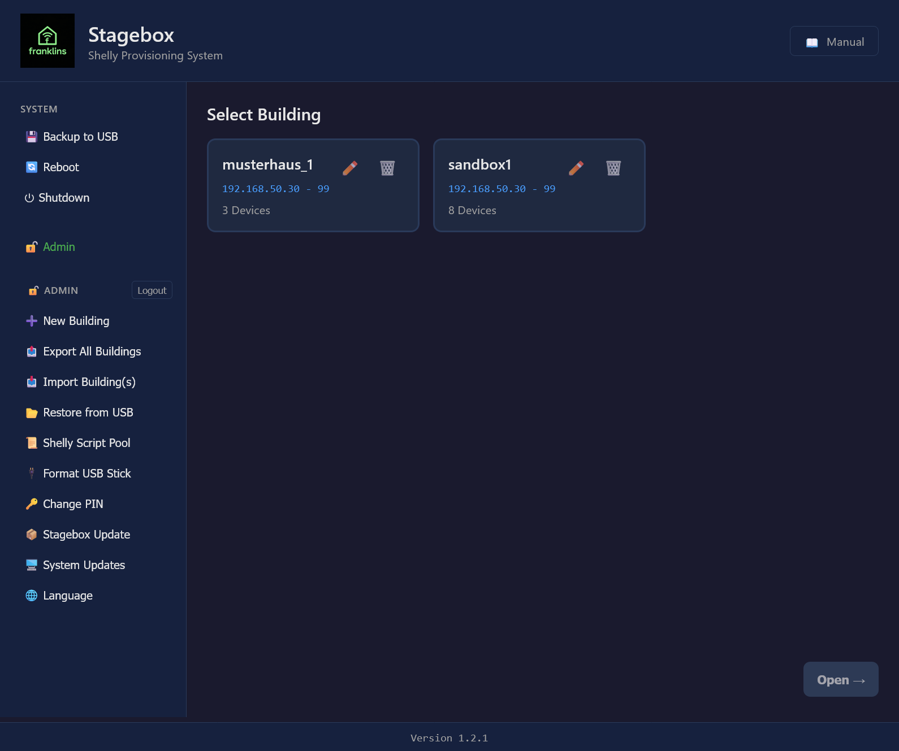

#### 2.1.1 Building List

The center area displays all available buildings as cards.

Each building card shows:
- Building name
- IP range summary
- Device count

**Actions (Admin mode only):**
- ✏️ Rename building
- 🗑️ Delete building

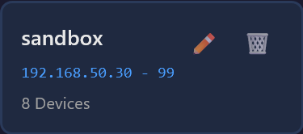

**Selecting a Building:**
- Single-click to select
- Double-click to open directly
- Click **Open →** after selecting

#### 2.1.2 System Section

Located on left side of the building list:

| Button | Function | Admin Required |
|--------|----------|----------------|
| 💾 Backup to USB | Create backup of all buildings to USB stick | No |
| 🔄 Reboot | Restart the Stagebox | No |
| ⏻ Shutdown | Safely shut down the Stagebox | No |

> **Important:** Always use **Shutdown** before disconnecting power to prevent data corruption.

#### 2.1.3 Admin Section

Administrative functions (requires Admin PIN):

| Button | Function |
|--------|----------|
| 🔒/🔓 Admin | Login/Logout |
| ➕ New Building | Create a new building |
| 📤 Export All Buildings | Download ZIP of all buildings |
| 📥 Import Building(s) | Import from ZIP file |
| 📜 Shelly Script Pool | Manage shared scripts |
| 📂 Restore from USB | Restore buildings from USB backup |
| 🔌 Format USB Stick | Prepare USB for backups |
| 🔑 Change PIN | Change Admin PIN |
| 📦 Stagebox Update | Check for software updates |
| 🖥️ System Updates | Check for OS updates |
| 🌐 Language | Change interface language |
| 🏢 Installer Profile | Configure company information for reports |


#### 2.1.4 USB Backup

**Creating a Backup:**

1. Insert a USB stick (any format)
2. If not formatted for Stagebox: Click **🔌 Format USB Stick** (Admin)
3. Click **💾 Backup to USB**
4. Wait for completion message
5. USB stick can now be safely removed

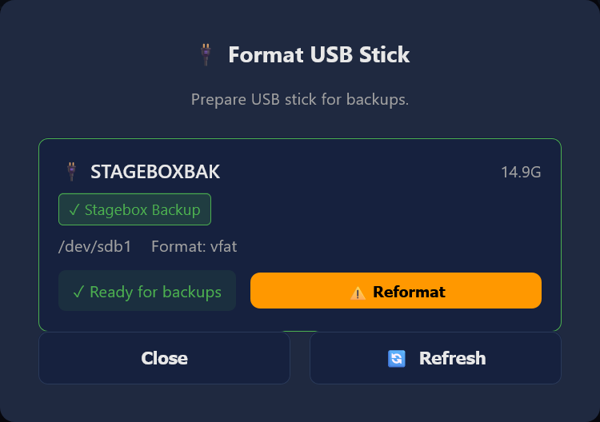

**Restoring from USB:**

1. Insert USB stick with backups
2. Click **📂 Restore from USB** (Admin)
3. Select a backup from the list
4. Choose buildings to restore
5. Click **Restore Selected**

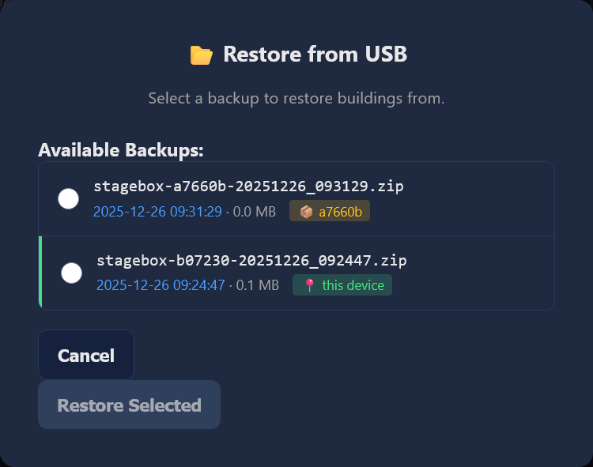

#### 2.1.5 Export/Import Buildings

**Export:**
1. Click **📤 Export All Buildings** (Admin)
2. A ZIP file downloads containing all building data

**Import:**
1. Click **📥 Import Building(s)** (Admin)
2. Drag & drop a ZIP file or click to select
3. Choose which buildings to import
4. Select action for existing buildings (skip/overwrite)
5. Click **Import Selected**

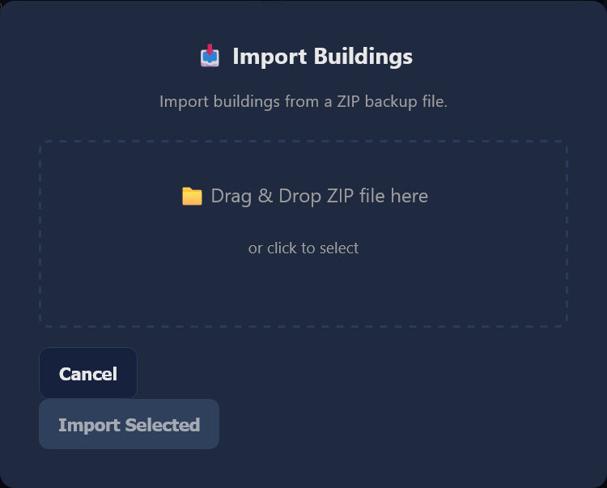

<div style="page-break-before: always;"></div>

### 2.2 Building Page

The Building Page is the main workspace for provisioning and managing devices in a specific building.

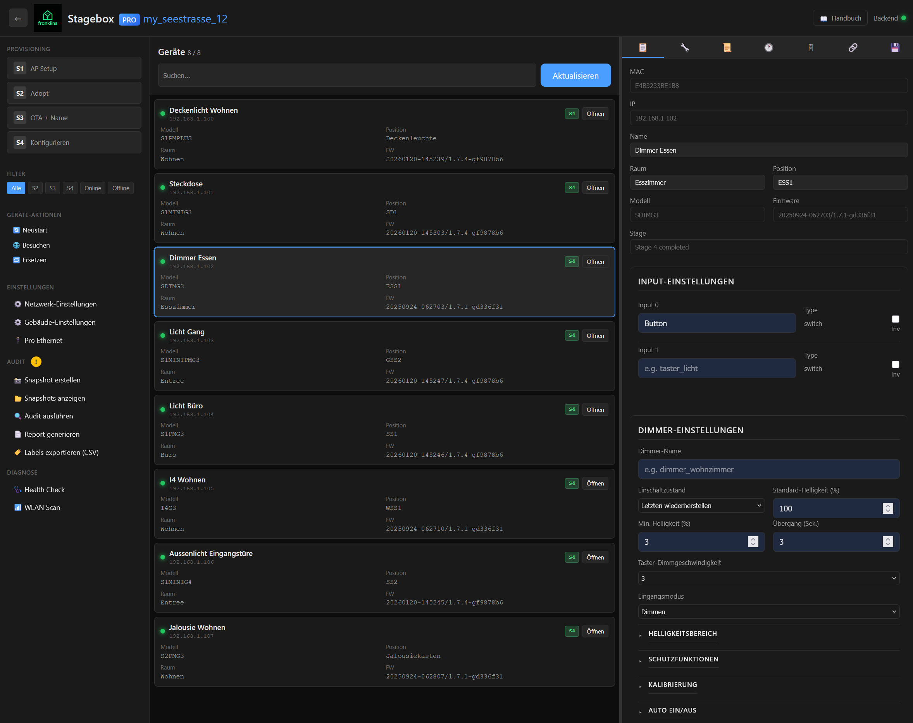

#### Layout:
- **Left Sidebar:** Provisioning stages, filters, actions, settings, diagnostics, audit
- **Center Area:** Device list
- **Right Sidebar:** Stage panels or device details, Script-, KVS-, Webhook-, Schedules- and OTA tabs

### 2.3 Left Sidebar

#### 2.3.1 Building Header

Shows the current building name. Click to return to the Greeting Page.
<div style="page-break-before: always;"></div>

#### 2.3.2 Provisioning Stages

The 4-stage provisioning pipeline:

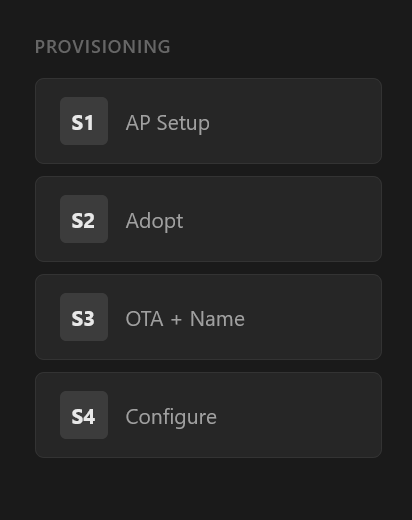

**S1 - AP Provisioning:**
- Scans for Shelly devices in AP (Access Point) mode
- Configures WiFi credentials
- Disables cloud, BLE, and AP mode

**S2 - Adopt:**
- Scans network for new devices (DHCP range)
- Assigns static IPs from the pool
- Registers devices in the database

**S3 - OTA & Names:**
- Updates firmware to latest version
- Syncs friendly names to devices

**S4 - Configure:**
- Applies device profiles
- Configures inputs, switches, covers, etc.

<div style="page-break-before: always;"></div>

#### 2.3.3 Stage 1: AP Provisioning

1. Click **S1** button
2. The Stagebox WiFi adapter searches for Shelly APs
3. Found devices are automatically configured, device found counter counts up
4. Click **⏹ Stop** when done


> **Tip:** Put Shelly devices into AP mode by holding the button for 10+ seconds or performing a factory reset.

<div style="page-break-before: always;"></div>

#### 2.3.4 Stage 2: Adopt

1. Click **S2** button
2. Click **Scan Network**
3. New devices appear in the list
4. Select devices to adopt or click **Adopt All**
5. Devices receive static IPs and are registered

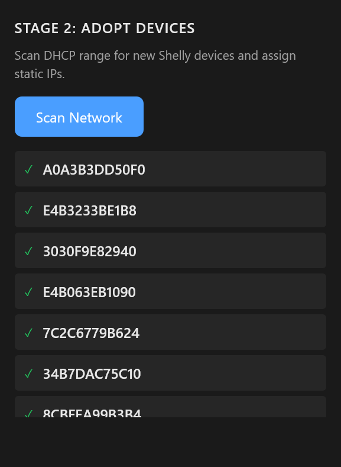

<div style="page-break-before: always;"></div>

#### 2.3.5 Stage 3: OTA & Names

1. Click **S3** button
2. Devices at Stage 2 are listed
3. Click **Run Stage 3** to:
   - Update firmware (if newer available)
   - Sync friendly names from database to devices

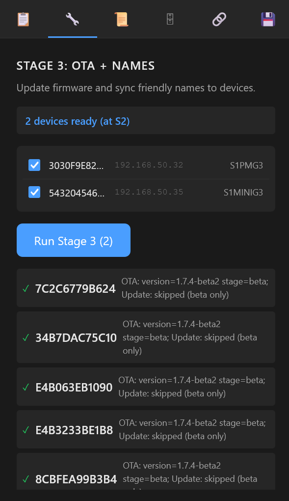

<div style="page-break-before: always;"></div>

#### 2.3.6 Stage 4: Configure

1. Click **S4** button
2. Devices at Stage 3 are listed
3. Click **Run Stage 4** to apply profiles:
   - Switch settings (initial state, auto-off)
   - Cover settings (swap directions, limits)
   - Input configurations
   - Custom actions

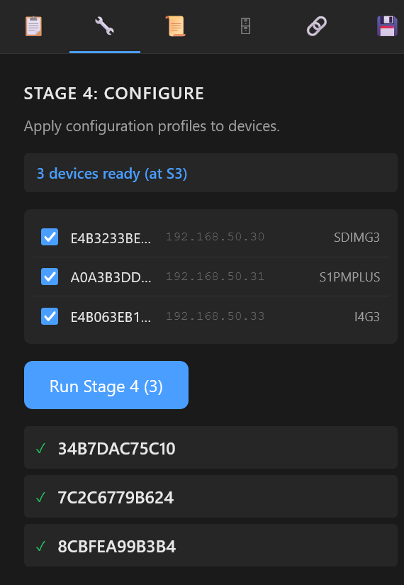

<div style="page-break-before: always;"></div>

#### 2.3.7 Filters

Filter the device list by various criteria:

| Filter | Description |
|--------|-------------|
| Stage | Show devices at specific provisioning stage |
| Room | Show devices in a specific room |
| Model | Show specific device types |
| Status | Online/Offline devices |

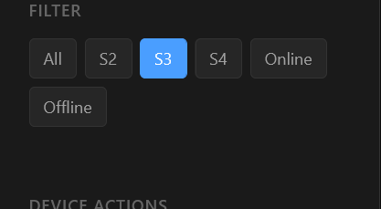

#### 2.3.8 Actions

Bulk operations on selected devices:

| Action | Description |
|--------|-------------|
| 🔄 Refresh | Update device status |
| 📋 Copy | Copy device info to clipboard |
| 📤 Export CSV | Export selected devices |
| 🗑️ Remove | Remove from database (Admin) |

<div style="page-break-before: always;"></div>

### 2.4 Device List

The center area shows all devices in the current building.

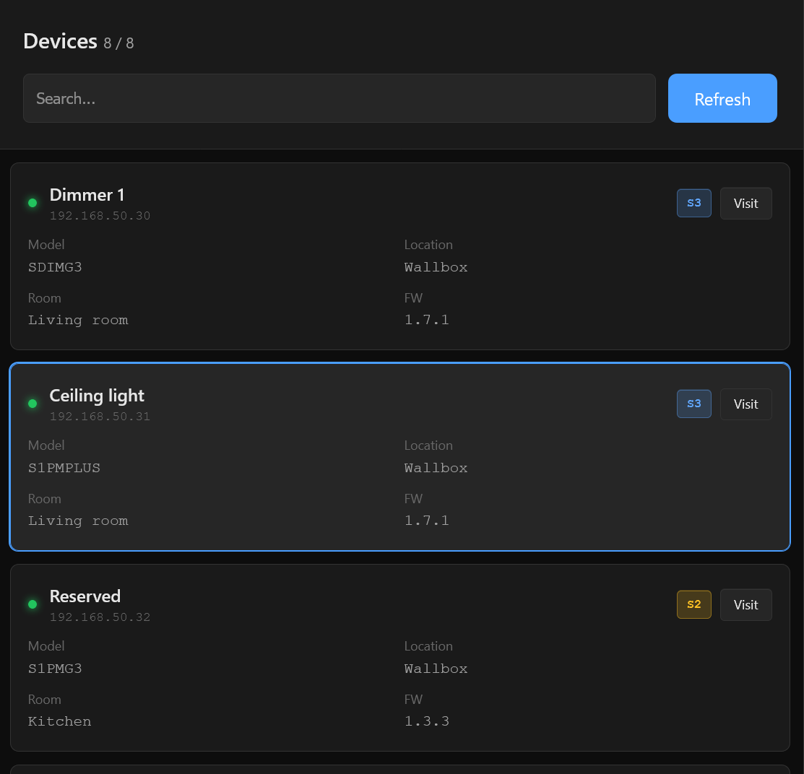

#### Columns:

| Column | Description |
|--------|-------------|
| ☑️ | Selection checkbox |
| Status | Online (🟢) / Offline (🔴) |
| Name | Device friendly name |
| Room | Assigned room |
| Location | Position within room |
| Model | Device type |
| IP | Current IP address |
| Stage | Current provisioning stage (S1-S4) |

#### Selection:
- Click checkbox to select individual devices
- Click header checkbox to select all visible
- Shift+click for range selection

#### Sorting:
- Click column header to sort
- Click again to reverse order

<div style="page-break-before: always;"></div>

### 2.5 Right Sidebar (Device Details)

When a device is selected, the right sidebar shows detailed information and actions.

#### 2.5.1 Device Info Tab

Basic device information:

| Field | Description |
|-------|-------------|
| Name | Editable friendly name |
| Room | Room assignment (editable) |
| Location | Position within room (editable) |
| MAC | Hardware address |
| IP | Network address |
| Model | Hardware model |
| Firmware | Current version |

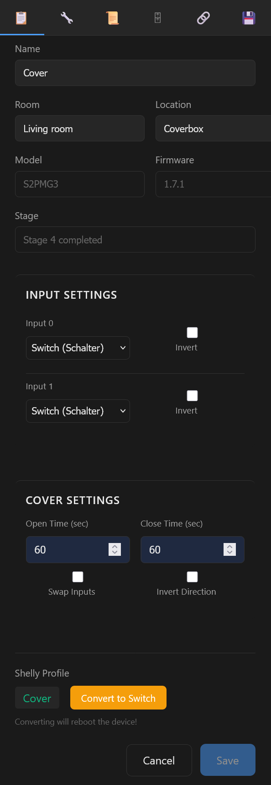

##### Calibration (Cover / Dimmer)

For supported devices, the Device Info Tab shows an additional calibration section:

- **Cover Calibration**: Starts motor calibration on the selected cover device. The device performs a full open/close cycle to determine the end positions.
- **Dimmer Calibration**: Starts calibration on the selected dimmer device to ensure correct control of the connected light source.

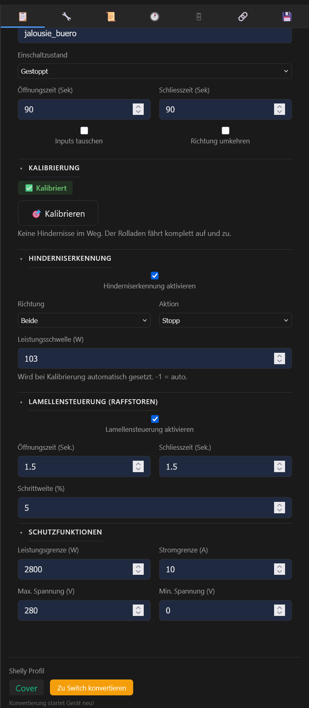

> **Note:** Calibration sections are only shown when the selected device has the corresponding component (Cover or Light/Dimmer).

<div style="page-break-before: always;"></div>

#### 2.5.2 Scripts Tab

Manage scripts on the selected device:

- View installed scripts
- Start/Stop scripts
- Remove scripts
- Deploy new scripts

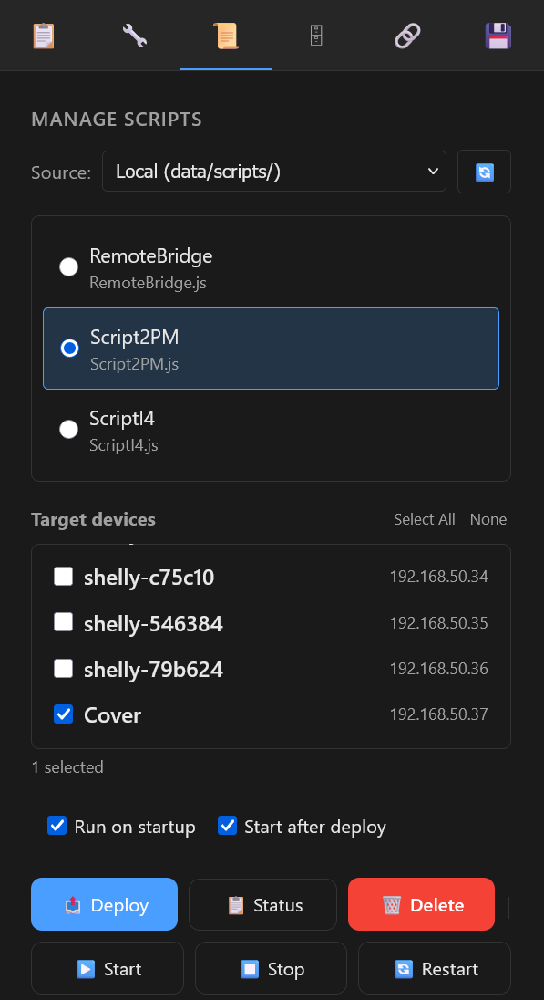

#### 2.5.3 KVS Tab

View and edit Key-Value Store entries:

- System values (read-only)
- User values (editable)
- Add new entries
- Delete entries

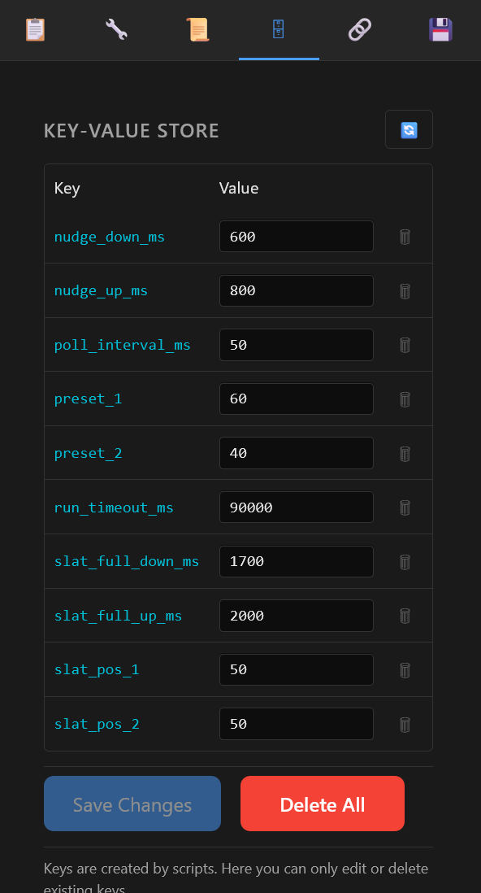
<div style="page-break-before: always;"></div>

#### 2.5.4 Webhooks Tab

Configure device webhooks:

- View existing webhooks
- Add new webhooks
- Edit URLs and conditions
- Delete webhooks

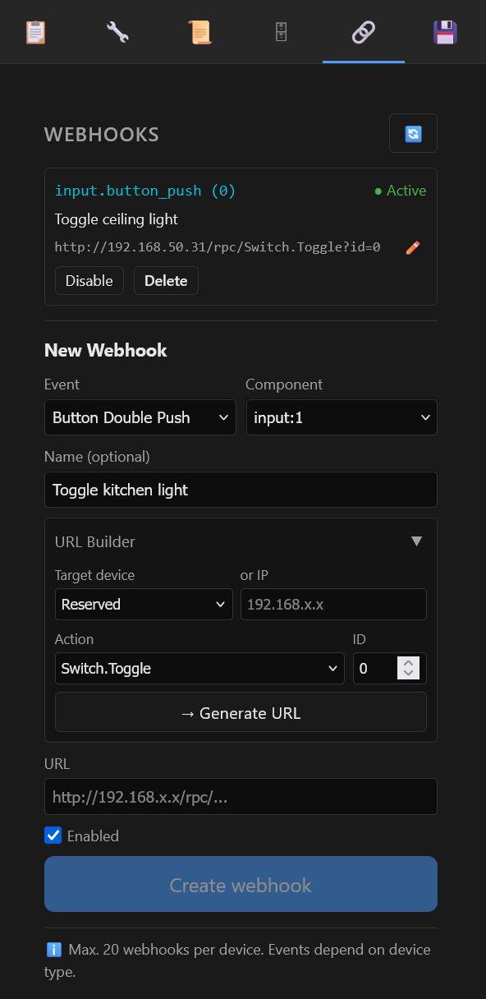
<div style="page-break-before: always;"></div>

#### 2.5.5 Schedules Tab

The Schedules Tab allows you to create, manage, and deploy time-based automations to Shelly devices. Schedules are stored as templates and can be deployed to multiple compatible devices at once.

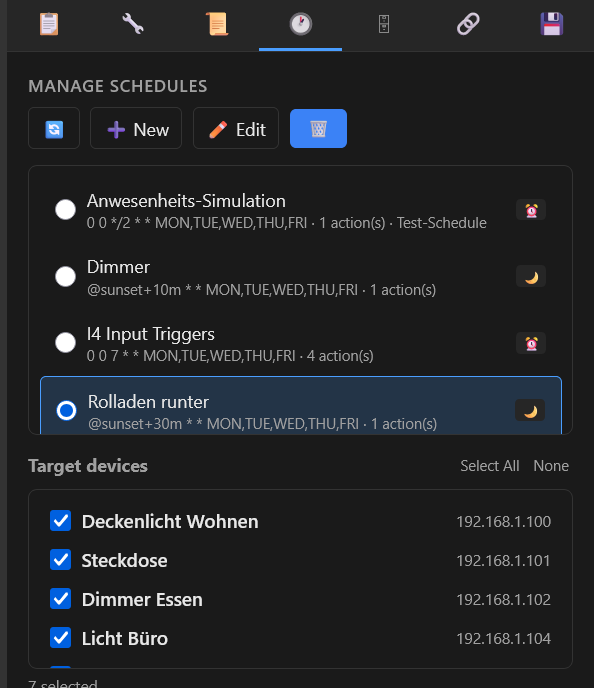

**Tab Overview:**

The Schedules Tab is divided into three areas:

1. **Template List** — saved schedule templates with edit/delete controls
2. **Target Devices** — checkbox list to select deployment targets
3. **Action Buttons** — Deploy, Status, and Delete All

##### Creating a Schedule

1. Click **+ New** to open the Schedule Editor modal
2. Enter a **Name** and optional **Description**

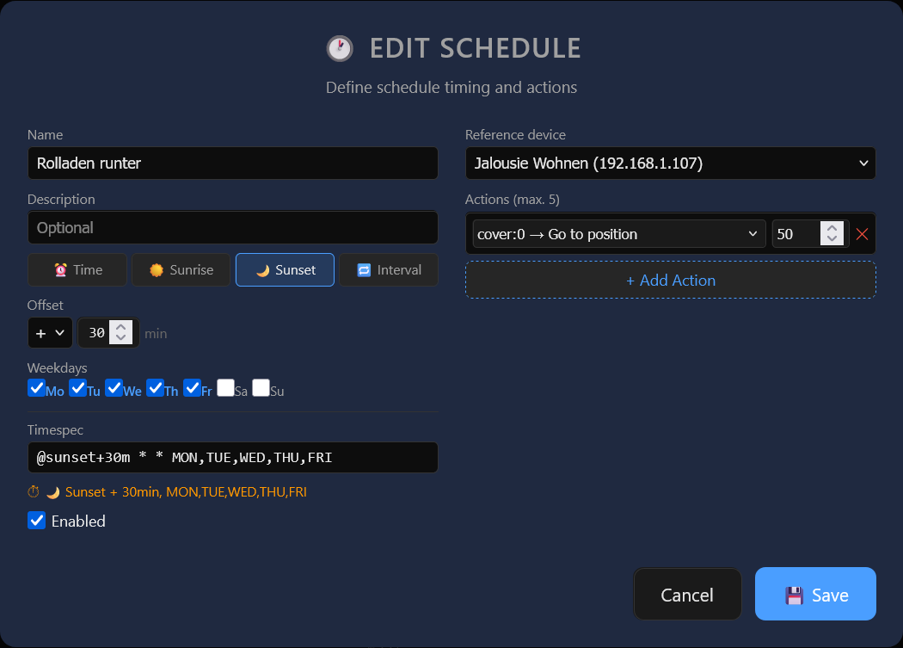

**Left Column — Timing:**

Select one of four timing modes:

| Mode | Description |
|------|-------------|
| 🕐 **Time** | Set a specific time of day (hours and minutes) |
| 🌅 **Sunrise** | Trigger at sunrise, with optional offset |
| 🌇 **Sunset** | Trigger at sunset, with optional offset |
| 📅 **Interval** | Repeat at regular intervals — choose from presets (every 5 min, 15 min, 30 min, hourly, every 2 hours) or enter custom minute/hour values |

Below the timing mode, select the **weekdays** using checkboxes (Mon–Sun).

The **timespec** field shows the generated Shelly cron expression (read-only). Below it, a preview displays the next scheduled execution times.

The **Enabled** checkbox controls whether the schedule is active after deployment.

**Right Column — Actions:**

3. Select a **Reference Device** from the dropdown — Stagebox queries this device to determine which components and actions are available (e.g., Switch, Cover, Light)
4. Add one or more **Actions** (up to 5 per schedule) by clicking **+ Add Action**:
   - The available methods depend on the reference device's components
   - Examples: `Switch.Set` (on/off), `Cover.GoToPosition` (0–100), `Light.Set` (on/off/brightness)
   - Remove an action with the **✕** button

5. Click **💾 Save** to store the template, or **Cancel** to discard

> **Tip:** The reference device determines which actions are available. Choose a device that has the components you want to control.

##### Editing a Schedule

- Click the **✏️ Edit** button next to a template, or **double-click** the template name
- The Schedule Editor modal opens pre-filled with the existing settings
- Modify and click **💾 Save**

##### Deploying Schedules

1. Select a schedule template from the list
2. Check the target devices in the **Target Devices** section
   - Use **Select All** / **None** for quick selection
   - Incompatible devices (missing required components) are automatically skipped during deployment
3. Click **📤 Deploy**
4. Results are shown per device with success/failure status

> **Note:** Before deploying, Stagebox checks each target device for the required components. Devices that lack the necessary components (e.g., deploying a Cover schedule to a Switch-only device) are skipped with an error message.

##### Checking Schedule Status

1. Select target devices
2. Click **📋 Status**
3. Stagebox queries each device and displays the schedules currently installed on it, including their timespec, method, and enabled/disabled state

##### Deleting Schedules from Devices

1. Select target devices
2. Click **🗑️ Delete All**
3. All schedules on the selected devices are removed

> **Warning:** Delete All removes **all** schedules from the selected devices, not just schedules deployed by Stagebox.

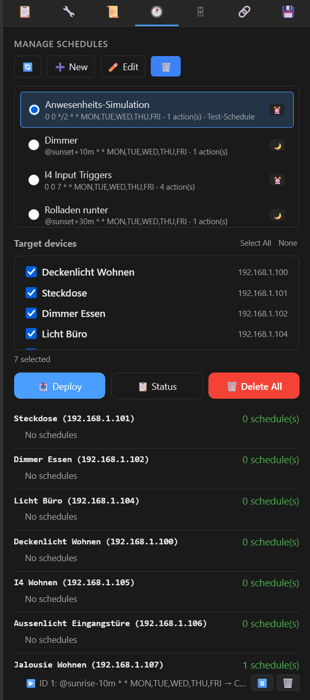
<div style="page-break-before: always;"></div>

#### 2.5.6 Virtual Components Tab

Configure virtual components on devices:

- Virtual switches
- Virtual sensors  
- Text components
- Number components


#### 2.5.7 FW-Updates Tab

Manage device firmware:

- View current version
- Check for updates
- Apply firmware updates

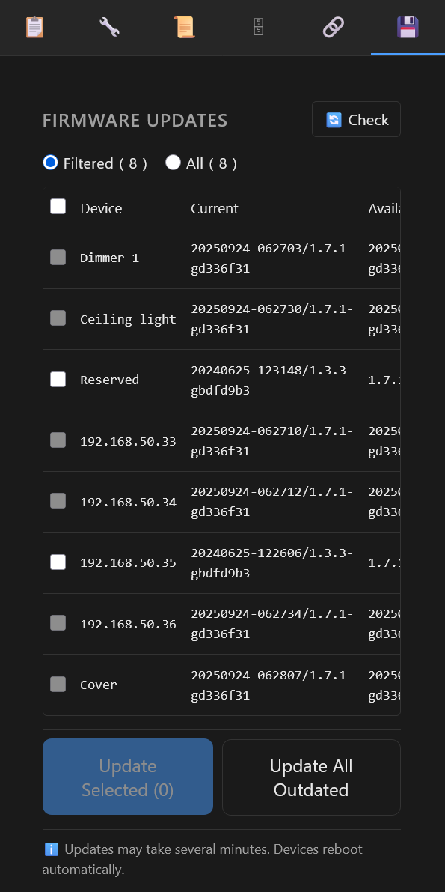
<div style="page-break-before: always;"></div>

### 2.6 Scripts Management

#### 2.6.1 Script Pool (Admin)

Manage shared scripts available for deployment:

1. Go to Greeting Page
2. Click **📜 Shelly Script Pool** (Admin)
3. Upload JavaScript files (.js)
4. Delete unused scripts

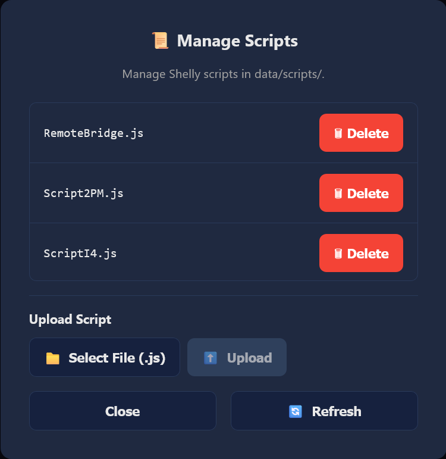
<div style="page-break-before: always;"></div>

#### 2.6.2 Deploying Scripts

1. Select target device(s) in device list
2. Go to **Scripts** tab
3. Select source: **Local** (Script Pool) or **GitHub Library**
4. Choose a script
5. Configure options:
   - ☑️ Run on startup
   - ☑️ Start after deploy
6. Click **📤 Deploy**

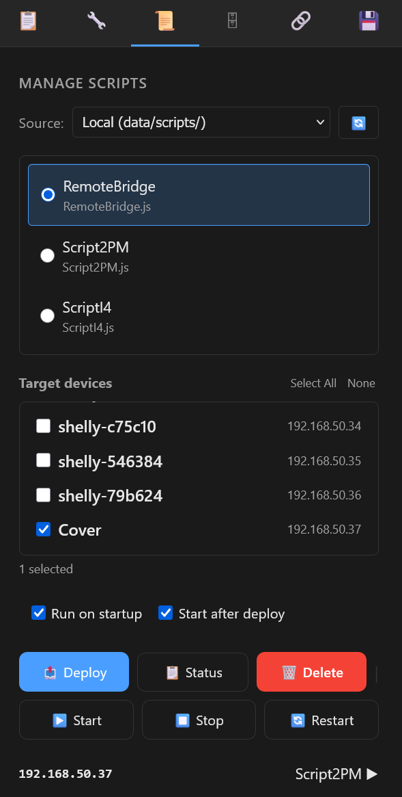

<div style="page-break-before: always;"></div>

### 2.7 Building Settings

Access via **Settings** section → **⚙️ Building Settings** in the Building Page sidebar.

The Building Settings dialog provides a tabbed interface for configuring all building-specific options.

**Tabs:** Object → Flags → Input Type → Stage 1 Options → Stage 3 Options → Model Map → System

---

#### 2.7.1 Object Tab

Project and customer information for this building. This data appears in generated reports.

**Available Fields:**

| Field | Description |
|-------|-------------|
| Object Name | Project or property name (e.g., "Villa Müller") |
| Customer Name | Customer's name |
| Address | Property address (multi-line supported) |
| Contact Phone | Customer's phone number |
| Contact Email | Customer's email address |
| Notes | Additional remarks (appear in reports) |

> **Note:** The Object Name is used as the report title. If not set, the building name is used instead.

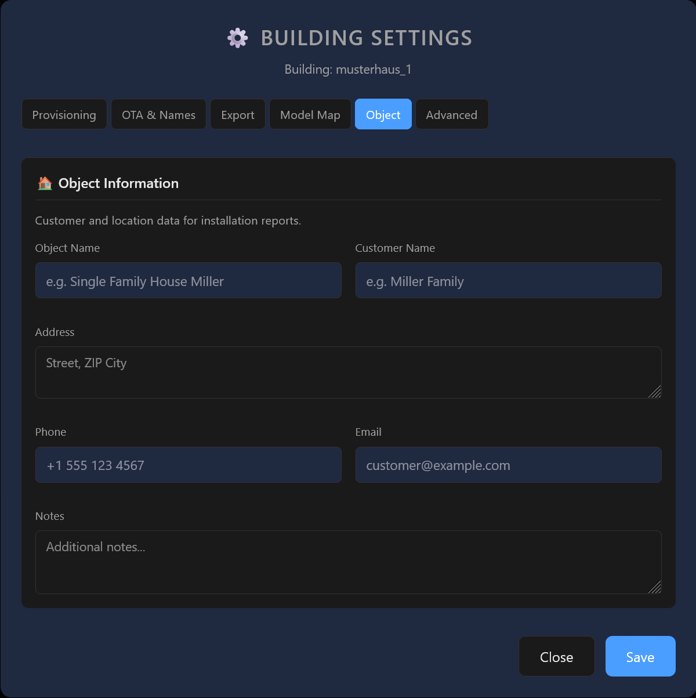

<div style="page-break-before: always;"></div>

#### 2.7.2 Flags Tab

Configure device flags for all devices in the building at once.

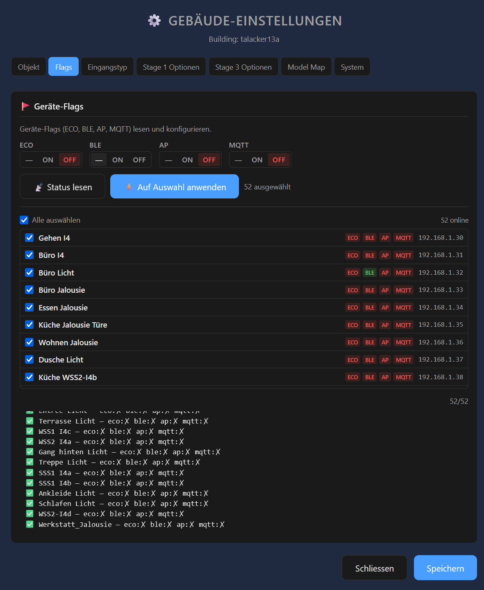

**Available Flags:**

| Flag | Description |
|------|-------------|
| **ECO Mode** | Enable/disable energy saving mode |
| **BLE** | Enable/disable Bluetooth Low Energy |
| **AP Mode** | Enable/disable Access Point mode |

**Usage:**

1. Select the desired devices using the checkboxes
2. Set or clear the desired flags
3. Click **Apply** to push the settings to the selected devices

<div style="page-break-before: always;"></div>

#### 2.7.3 Input Type Tab

Configure input types for all device inputs in the building at once.

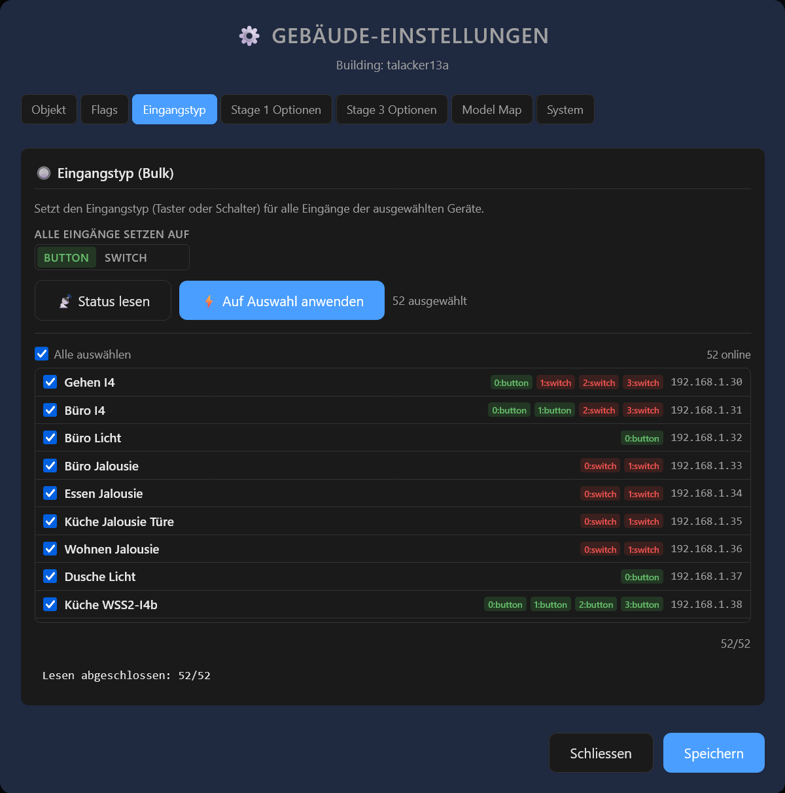

Each physical input of a Shelly device can be configured as **Button** (momentary) or **Switch** (toggle). Devices with multiple inputs (e.g., I4 with 4 inputs) are fully supported.

**Usage:**

1. Select the desired devices using the checkboxes
2. Choose the desired input type: **Button** or **Switch**
3. Click **Apply** to push the setting to all inputs of the selected devices

<div style="page-break-before: always;"></div>

#### 2.7.4 Stage 1 Options

Controls how Stage 1 (AP Mode) provisioning behaves.

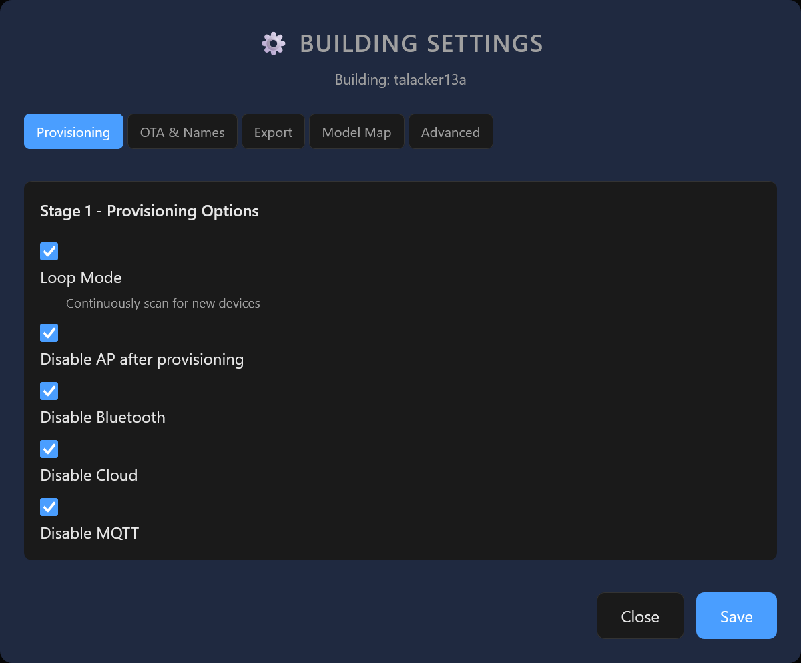

| Setting | Description | Default |
|---------|-------------|---------|
| **Loop Mode** | Continuously scan for new devices. When enabled, Stage 1 keeps searching for new Shelly APs after each successful provisioning. Disable for single-device provisioning. | ☑️ On |
| **Disable AP after provisioning** | Turn off the device's WiFi Access Point after it connects to your network. Recommended for security. | ☑️ On |
| **Disable Bluetooth** | Turn off Bluetooth on provisioned devices. Saves power and reduces attack surface. | ☑️ On |
| **Disable Cloud** | Disable Shelly Cloud connectivity. Devices will only be accessible locally. | ☑️ On |
| **Disable MQTT** | Turn off MQTT protocol on devices. Enable if you use a home automation system with MQTT. | ☑️ On |

---

#### 2.7.5 Stage 3 Options

Configure firmware update behavior and friendly name handling during Stage 3.

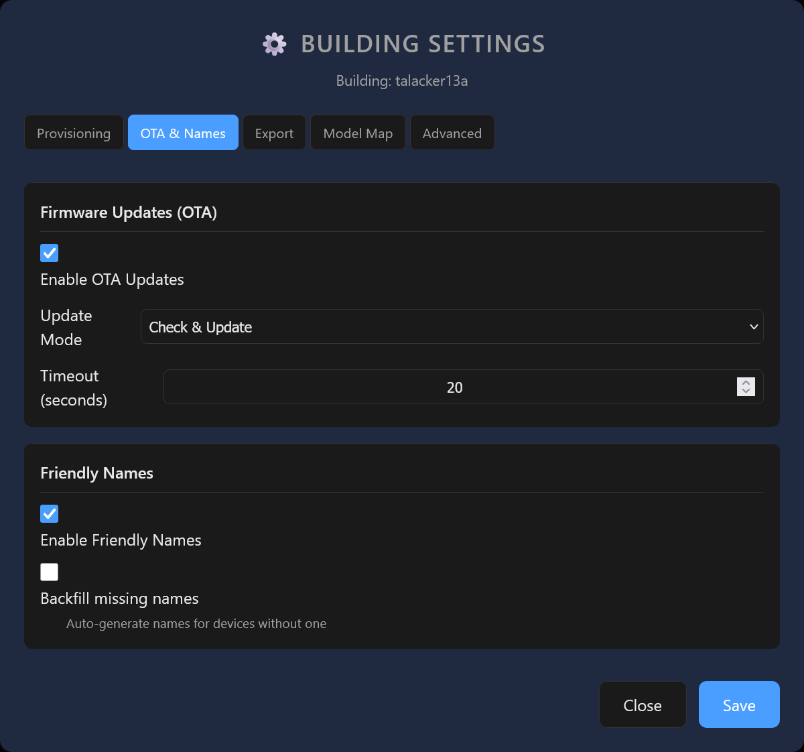

**Firmware Updates (OTA):**

| Setting | Description | Default |
|---------|-------------|---------|
| **Enable OTA Updates** | Check for and optionally install firmware updates during Stage 3. | ☑️ On |
| **Update Mode** | `Check only`: Report available updates without installing. `Check & Update`: Automatically install available updates. | Check only |
| **Timeout (seconds)** | Maximum wait time for OTA operations. Increase for slow networks. | 20 |

**Friendly Names:**

| Setting | Description | Default |
|---------|-------------|---------|
| **Enable Friendly Names** | Apply room/location names to devices during Stage 3. Names are stored in the device's configuration. | ☑️ On |
| **Backfill missing names** | Auto-generate names for devices that don't have one assigned. Uses the pattern `<Model>_<MAC-suffix>`. | ☐ Off |

<div style="page-break-before: always;"></div>

#### 2.7.6 Model Map Tab

Define custom display names for Shelly hardware model IDs.

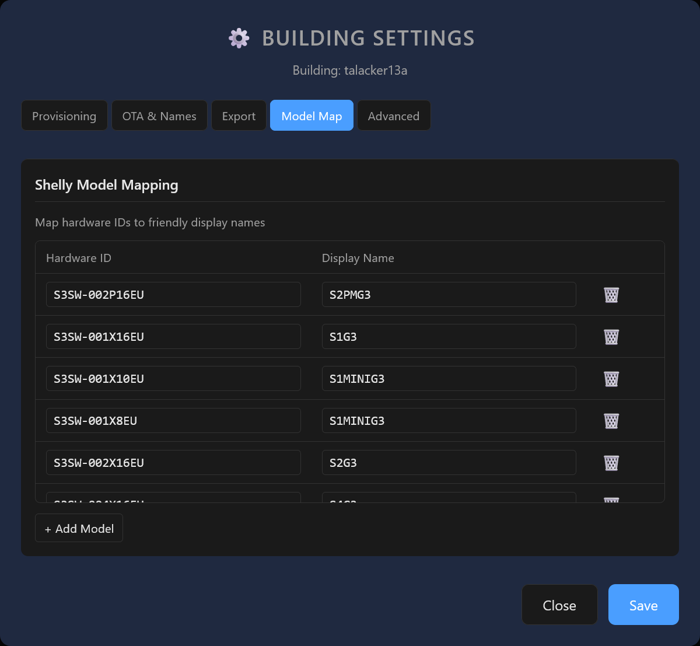

The Model Map translates internal hardware identifiers (e.g., `SNSW-001X16EU`) to human-readable names (e.g., `Shelly Plus 1`).

**Usage:**
1. Enter the **Hardware ID** exactly as reported by the device
2. Enter your preferred **Display Name**
3. Click **+ Add Model** to add more entries
4. Click **🗑️** to remove an entry

> **Tip:** Check the device's web interface or API response to find the exact hardware ID string.

<div style="page-break-before: always;"></div>

#### 2.7.7 System Tab

Configure system-wide settings per building.

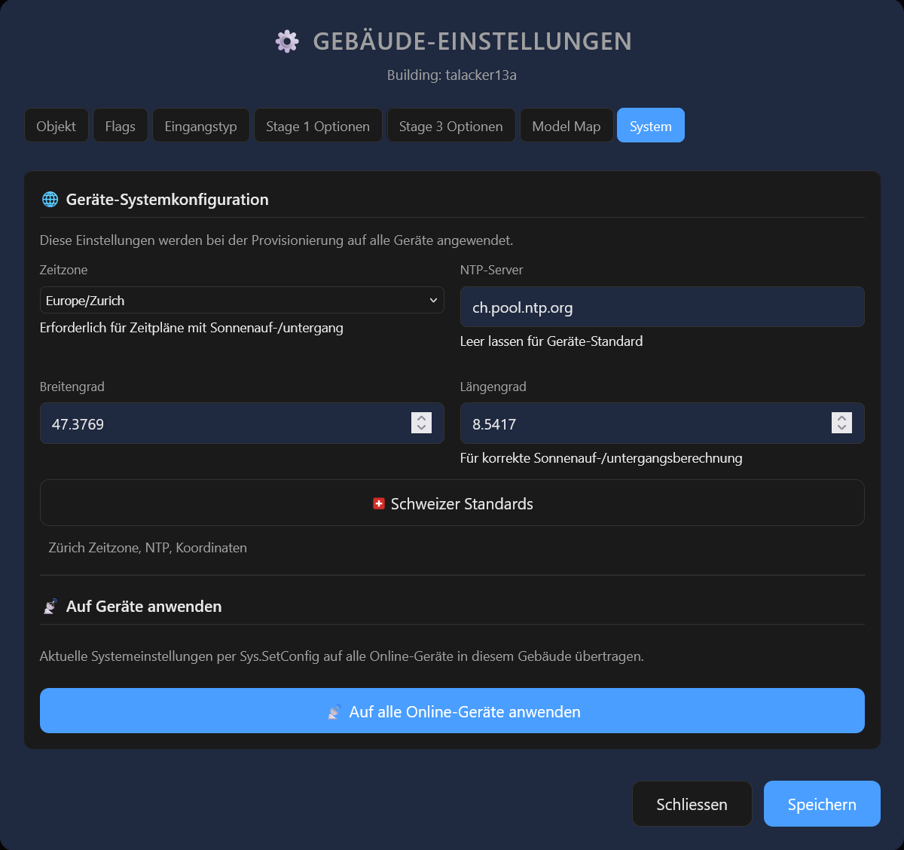

| Setting | Description |
|---------|-------------|
| **Timezone** | Timezone for schedules and time-based automations |
| **NTP Server** | Server for device time synchronization |
| **GPS Coordinates** | Latitude and longitude of the building location, required for sunrise/sunset calculations in schedules |

**Swiss Defaults:** Click the **Swiss Defaults** button to automatically fill in timezone (`Europe/Zurich`), NTP server, and a central Swiss location.

**Apply to Devices:** Click **Apply to Devices** to push the settings to all devices in the building via `Sys.SetConfig`.

<div style="page-break-before: always;"></div>

### 2.8 Pro Ethernet

Switch Shelly Pro devices between WiFi and Ethernet — in both directions.

Access via **Settings** section → **🔌 Pro Ethernet** in the Building Page sidebar.

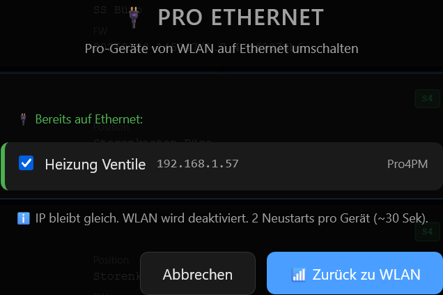

**How it works:**

- Automatically detects Pro devices already on Ethernet
- IP address remains unchanged during switchover
- WiFi is disabled when switching to Ethernet (and vice versa)
- 2 reboots per device required (~30 seconds)

**Usage:**

1. Click **🔌 Pro Ethernet**
2. Choose the desired direction (WiFi → Ethernet or Ethernet → WiFi)
3. Select the devices
4. Click **Switch**

> **Note:** Only Shelly Pro devices (e.g., Pro4PM, Pro2PM) support Ethernet. Other devices are not shown.

<div style="page-break-before: always;"></div>

### 2.9 Diagnostics

The Diagnostics section in the sidebar provides tools for troubleshooting and status monitoring.

#### 2.9.1 Health Check

The Health Check queries all devices in the building and displays a detailed status overview.

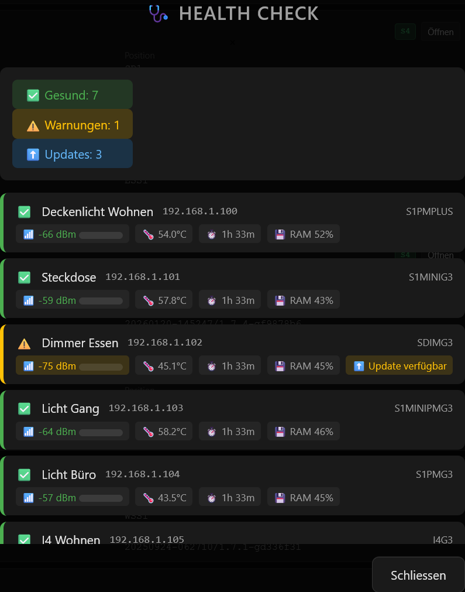

**Summary:**

Three status badges are shown at the top:
- ✅ **Healthy**: Devices without issues
- ⚠️ **Warnings**: Devices with issues (e.g., weak WiFi signal, high temperature)
- ⬆️ **Updates**: Devices with available firmware updates

**Per device:**

| Information | Description |
|-------------|-------------|
| WiFi Signal | Signal strength in dBm with graphical indicator |
| CPU Temperature | Current processor temperature |
| Uptime | Time since last reboot |
| RAM | Memory usage in percent |
| Update notice | If a newer firmware is available |

Devices with warnings are highlighted.

<div style="page-break-before: always;"></div>

#### 2.9.2 WiFi Scan

The WiFi Scan shows available wireless networks from the perspective of a selected device.

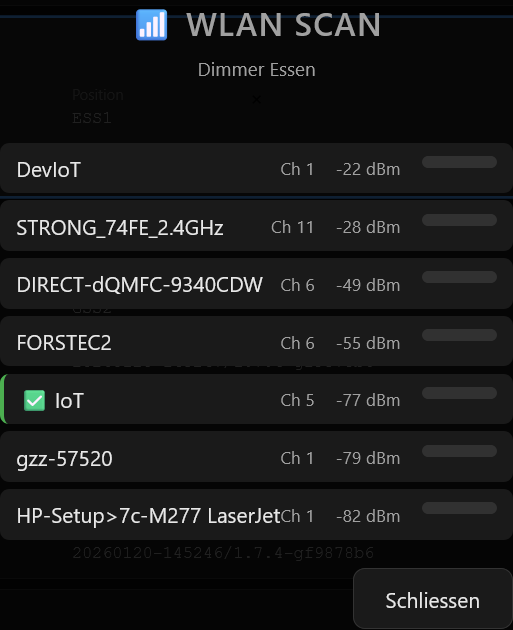

**Usage:**

1. Select a device in the device list
2. Click **📡 WiFi Scan** in the Diagnostics section
3. The device scans its surroundings and shows all visible networks

**Per network:**

| Information | Description |
|-------------|-------------|
| SSID | Network name |
| Channel | WiFi channel |
| Signal | Signal strength in dBm with graphical indicator |

The currently connected network is highlighted.

> **Tip:** Use the WiFi Scan to diagnose connectivity issues — e.g., to check whether the target WiFi is visible at the device's location and how strong the signal is.

<div style="page-break-before: always;"></div>

### 2.10 System Maintenance

#### 2.10.1 Stagebox Updates

Check for and install Stagebox software updates:

1. Go to Greeting Page
2. Click **📦 Stagebox Update** (Admin)
3. Current and available versions are shown
4. Click **⬇️ Install Update** if available
5. Wait for installation and automatic restart

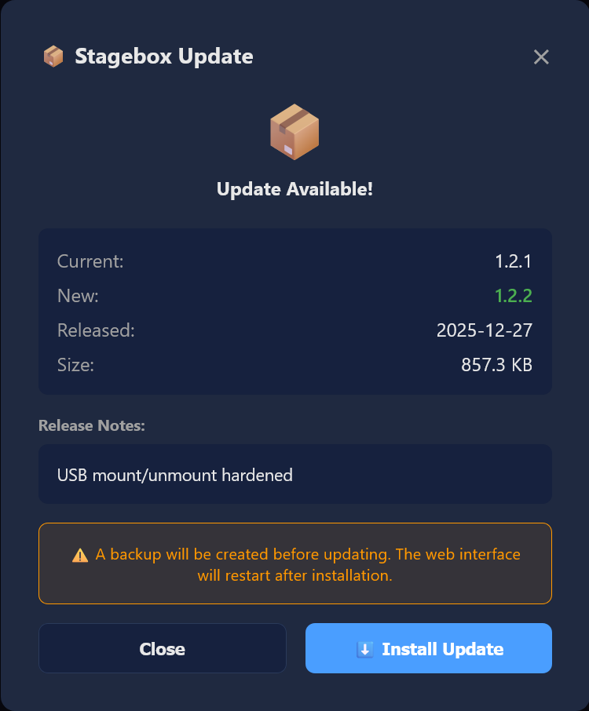
<div style="page-break-before: always;"></div>

#### 2.10.2 System Updates

Check for and install operating system updates:

1. Go to Greeting Page
2. Click **🖥️ System Updates** (Admin)
3. Security and system updates are listed
4. Click **⬇️ Install Updates**
5. System may reboot if required

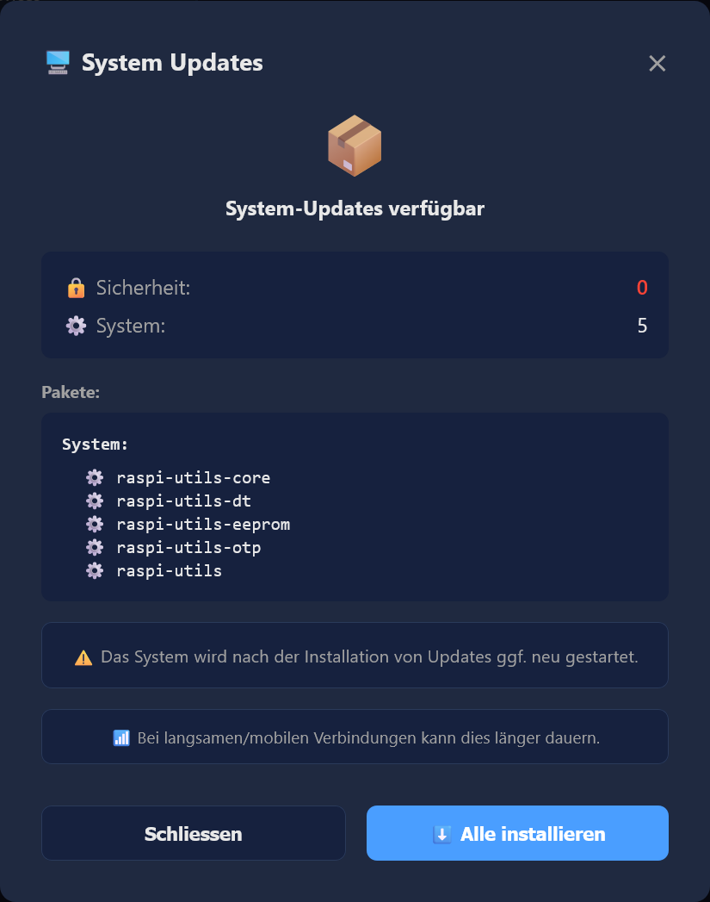

---

<div style="page-break-before: always;"></div>

### 2.11 Reports & Documentation

Stagebox provides comprehensive reporting features for professional installation documentation. Reports include device inventories, configuration details, and can be customized with installer branding.

#### 2.11.1 Installer Profile

The Installer Profile contains your company information that appears on all generated reports. This is a global setting shared across all buildings.

**Accessing the Installer Profile:**

1. Go to the Greeting Page
2. Click **🏢 Installer Profile** (Admin required)

**Available Fields:**

| Field | Description |
|-------|-------------|
| Company Name | Your company or business name |
| Address | Street address (multi-line supported) |
| Phone | Contact phone number |
| Email | Contact email address |
| Website | Company website URL |
| Logo | Company logo image (PNG, JPG, max 2MB) |

**Logo Guidelines:**
- Recommended size: 400×200 pixels or similar aspect ratio
- Formats: PNG (transparent background recommended) or JPG
- Maximum file size: 2MB
- The logo appears in the header of PDF reports

> **Tip:** Complete the Installer Profile before generating your first report to ensure professional-looking documentation.

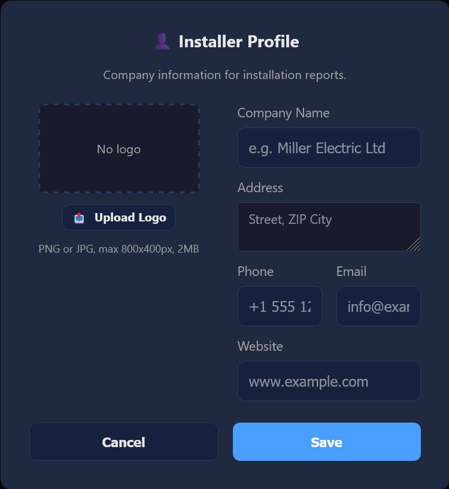

<div style="page-break-before: always;"></div>

#### 2.11.2 Label Export

Export device labels as a CSV file. The Label Export is located in the **Audit** section of the sidebar.

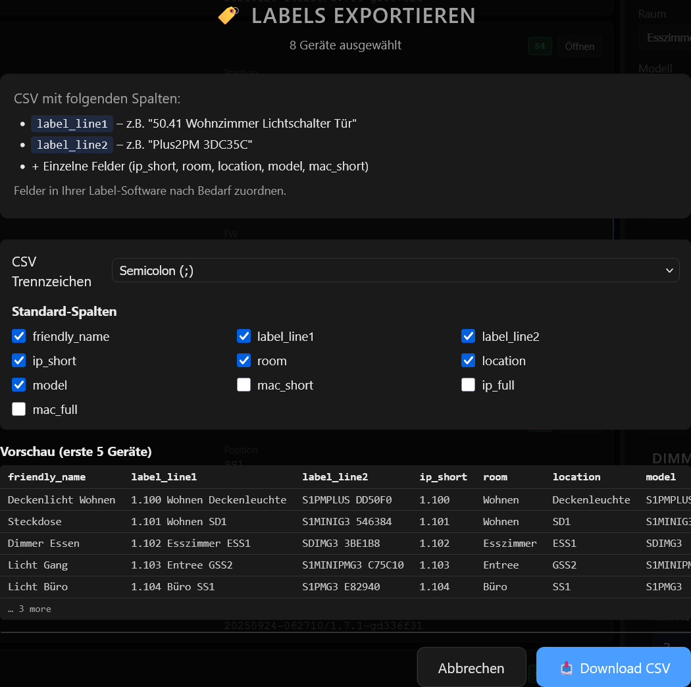

**CSV Delimiter:**

Choose the column separator directly in the export dialog:
- **Semicolon (;)** — Default, works with European Excel versions
- **Comma (,)** — Standard CSV format
- **Tab** — For tab-separated values

**Column Selection:**

Use checkboxes to choose which columns appear in the exported CSV file. Available columns include: MAC, IP, Hostname, Firmware, Model, Name, Room, Location, and other device-specific fields.

**Preview:**

The dialog shows a live preview of the first 5 devices with the currently selected columns and delimiter.

> **Note:** The exported CSV file includes a UTF-8 BOM header for correct display of umlauts and special characters in Excel.

<div style="page-break-before: always;"></div>

#### 2.11.3 Snapshots

A snapshot captures the complete state of all devices in a building at a specific point in time. Snapshots are stored as ZIP bundles containing device data and configuration files.

**Creating a Snapshot:**

1. Open the Building Page
2. Go to **Audit** section in the sidebar
3. Click **📸 Snapshots**
4. Wait for the scan to complete

**Snapshot Management:**

| Action | Description |
|--------|-------------|
| 📥 Download | Download the snapshot ZIP bundle |
| 🗑️ Delete | Remove the snapshot |

**Snapshot ZIP Contents:**

Each snapshot is stored as a ZIP file containing:

| File | Description |
|------|-------------|
| `snapshot.json` | Complete device scan data (IP, MAC, config, status) |
| `installer_profile.json` | Installer company information |
| `installer_logo.png` | Company logo (if configured) |
| `ip_state.json` | Device database with room/location assignments |
| `building_profile.json` | Object/customer information |
| `config.yaml` | Building configuration |
| `shelly_model_map.yaml` | Custom model name mappings (if configured) |
| `scripts/*.js` | Deployed scripts (if any) |

> **Tip:** Snapshots are self-contained bundles that can be used with external documentation tools or archived for future reference.

**Automatic Cleanup:**

Stagebox automatically keeps only the 5 most recent snapshots per building to conserve storage space.

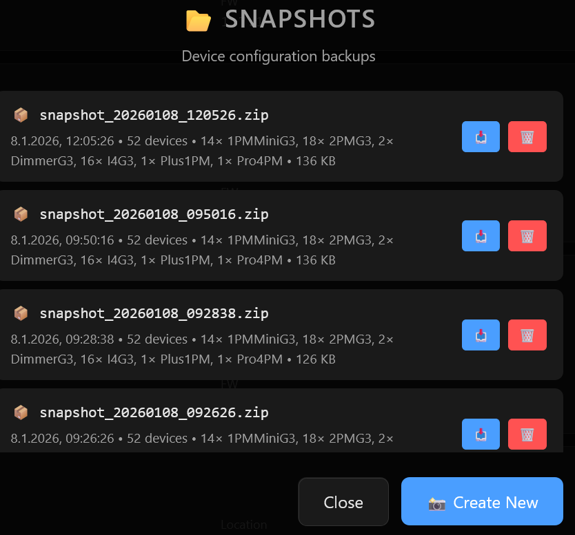

<div style="page-break-before: always;"></div>

#### 2.11.4 Report Generator

Generate professional installation reports in PDF or Excel format.

**Generating a Report:**

1. Open the Building Page
2. Go to **Audit** section in the sidebar
3. Click **📊 Report Generator**
4. Configure report options:
   - **Snapshot**: Create new or select existing snapshot
   - **Language**: Report language (DE, EN, FR, IT, NL)
   - **Format**: PDF or Excel (XLSX)
5. Click **Generate**

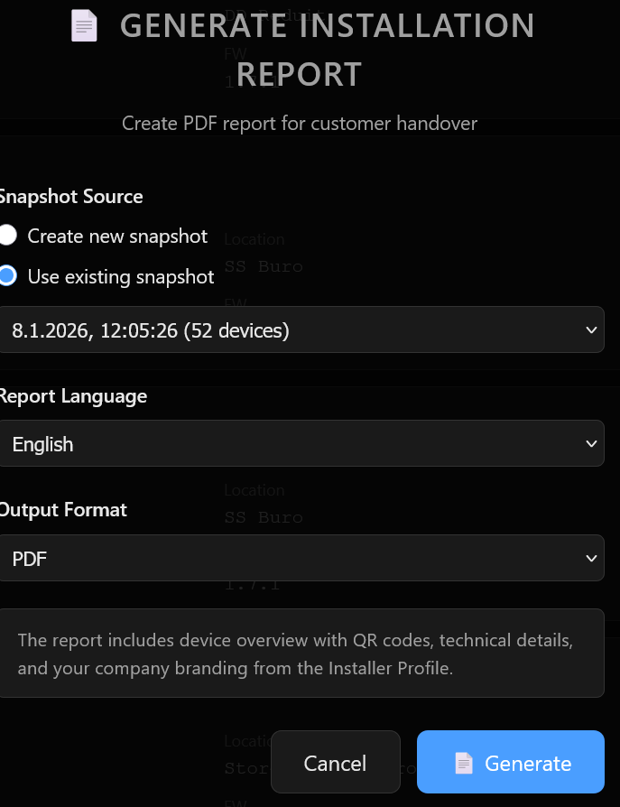

**PDF Report Contents:**

The PDF report includes:
- **Header**: Company logo, report title, generation date
- **Object Information**: Customer name, address, contact details
- **Summary**: Total devices, rooms, and device types
- **Device Table**: Complete inventory with QR codes

**Device Table Columns:**

| Column | Description |
|--------|-------------|
| QR | QR code linking to device web interface |
| Room | Assigned room |
| Location | Position within room |
| Name | Device friendly name |
| Model | Device type |
| IP | Network address |
| FW | Firmware version |
| MAC | Last 6 characters of MAC address |
| SWTAK | Feature flags (see below) |

**Feature Flags (SWTAK):**

Each device shows which features are configured:

| Flag | Meaning | Source |
|------|---------|--------|
| **S** | Scripts | Device has scripts installed |
| **W** | Webhooks | Device has webhooks configured |
| **T** | Timers | Auto-on or auto-off timers active |
| **A** | Schedules | Scheduled automations configured |
| **K** | KVS | Key-Value Store entries present |

Active flags are highlighted, inactive flags are grayed out.

**Excel Report:**

The Excel export contains the same information as the PDF in spreadsheet format:
- Single worksheet with all devices
- Header with report metadata
- Legend explaining the SWTAK flags
- Columns optimized for filtering and sorting

> **Tip:** Use Excel format when you need to further process the data or create custom documentation.

<div style="page-break-before: always;"></div>

#### 2.11.5 Configuration Audit

The Audit feature compares the current live state of all devices against a reference snapshot to detect configuration changes, new devices, or offline devices.

**Running an Audit:**

1. Open the Building Page
2. Go to **Audit** section in the sidebar
3. Click **🔍 Run Audit**
4. Select a reference snapshot from the dropdown
5. Click **🔍 Start Audit**

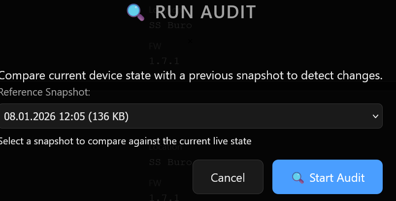

The system will perform a fresh scan of all devices and compare them against the selected snapshot.

**Audit Results:**

| Status | Icon | Description |
|--------|------|-------------|
| OK | ✅ | Device unchanged since snapshot |
| Changed | ⚠️ | Configuration differences detected |
| Offline | ❌ | Device was in snapshot but not responding |
| New | 🆕 | Device found that wasn't in snapshot |

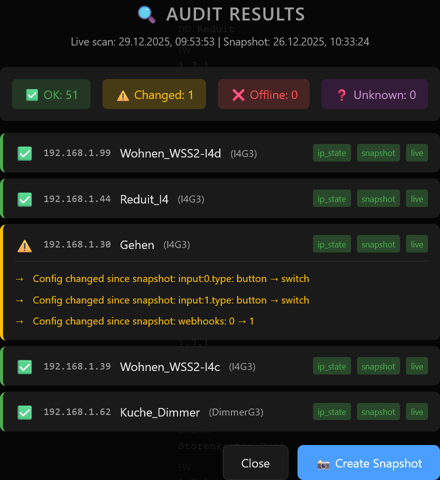

**Detected Changes:**

The audit detects and reports:
- IP address changes
- Device name changes
- Firmware updates
- Configuration changes (input types, switch settings, cover settings)
- WiFi setting modifications
- New or missing devices

**Use Cases:**

- **Post-Installation Verification**: Confirm all devices are configured as documented
- **Maintenance Checks**: Detect unexpected changes since last visit
- **Troubleshooting**: Identify which settings have been modified
- **Handover Documentation**: Verify installation matches specification before handover

> **Tip:** Create a snapshot after completing an installation to use as a reference for future audits.

<div style="page-break-before: always;"></div>

## Appendix

### A. Keyboard Shortcuts

| Shortcut | Action |
|----------|--------|
| `Escape` | Close dialog/modal |
| `Enter` | Confirm dialog |

### B. Status Indicators

| Icon | Meaning |
|------|---------|
| 🟢 (green)| Device online |
| 🔴 (red)| Device offline |
| S1-S4 | Current provisioning stage |
| ⚡ | Firmware update available |

### C. Troubleshooting

**Can't access Web-UI:**
- Verify Ethernet connection
- Check if Stagebox has IP (router DHCP list or OLED display)
- Try IP address directly instead of .local

**Forgot Admin PIN:**
- Hold the OLED button for **10+ seconds**
- The display will show "PIN RESET" and "PIN = 0000"
- The PIN is now reset to the default `0000`
- Log in with `0000` and change the PIN immediately

**Devices not found in Stage 1:**
- Ensure device is in AP mode (LED blinking)
- Move Stagebox closer to device
- Check WiFi adapter connection

**Devices not found in Stage 2:**
- Verify DHCP range settings
- Check if device connected to correct WiFi
- Wait 30 seconds after Stage 1

**Stage 4 fails:**
- Check device compatibility
- Verify profile exists for device type
- Check device is online

**USB Backup errors:**
- Remove and reinsert USB stick
- If error persists, refresh page (Ctrl+F5)
- Ensure USB stick is formatted for Stagebox (Admin → Format USB Stick)

**Report generation slow:**
- Large installations (50+ devices) may take 10-20 seconds
- PDF generation includes QR code creation for each device
- Use Excel format for faster generation without QR codes

---

*Stagebox Web-UI Manual - Version 1.2.0*