# Manuale utente Stagebox Web-UI

> *Questo manuale corrisponde alla Stagebox Pro Versione 1.1.0*

## Parte 1: Primi passi

Questa guida vi accompagna nella configurazione iniziale della vostra Stagebox e nella creazione del vostro primo progetto edificio.
  


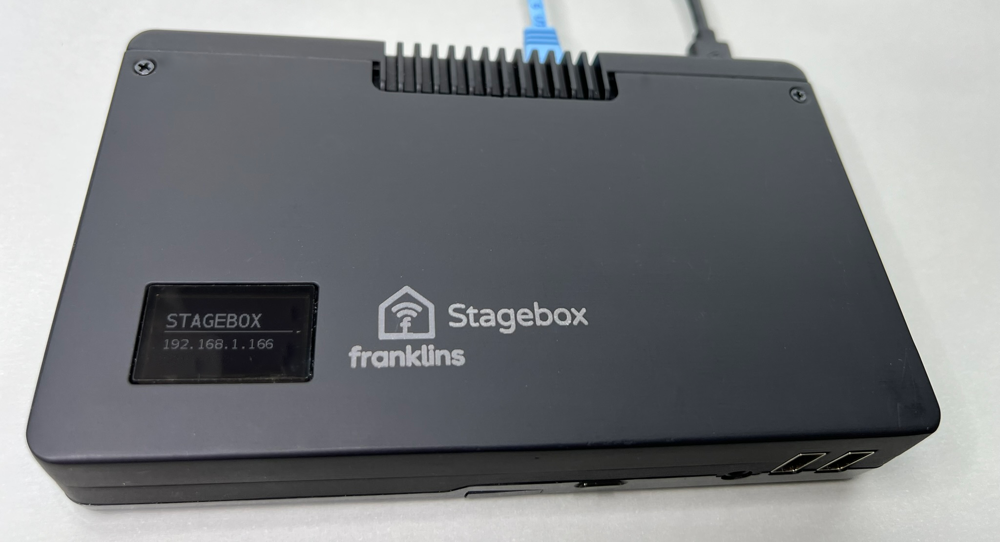

### 1.1 Collegamento della Stagebox

1. Collegare la Stagebox alla rete tramite un cavo Ethernet
2. Collegare l'alimentatore
3. Attendere circa 60 secondi per l'avvio del sistema
4. Il display OLED sul pannello frontale mostra le informazioni di connessione

> **Nota:** La Stagebox richiede una connessione di rete cablata. Il WiFi viene utilizzato solo per il provisioning dei dispositivi Shelly.

<div style="page-break-before: always;"></div>

### 1.2 Utilizzo del display OLED

La Stagebox dispone di un display OLED integrato che alterna automaticamente tra diverse schermate informative (ogni 10 secondi).

**Schermata 1 — Splash (Identificazione principale):**

```
┌────────────────────────────┐
│                            │
│   ███ STAGEBOX ███         │
│                            │
│ ────────────────────────── │
│                            │
│   192.168.1.100            │
│                            │
│   A1:B2:C3                 │
│                            │
└────────────────────────────┘
```

Questa schermata mostra:
- Titolo «STAGEBOX»
- Indirizzo IP per l'accesso web
- Suffisso MAC (ultimi 6 caratteri per l'identificazione)

**Schermata 2 — Info edificio:**
- Versione attuale della Stagebox
- Nome dell'edificio attivo

**Schermata 3 — Stato del sistema:**
- Temperatura e carico CPU
- Temperatura NVMe
- Utilizzo RAM e disco

**Schermata 4 — Rete:**
- Indirizzo IP Ethernet
- Indirizzo IP WLAN (se connesso)
- Hostname

**Schermata 5 — Orologio:**
- Ora attuale con secondi
- Data attuale

<div style="page-break-before: always;"></div>

**Funzioni del pulsante OLED:**

Il pulsante sul case Argon ONE controlla il display:

| Durata pressione | Azione |
|------------------|--------|
| Pressione breve (<2s) | Passare alla schermata successiva |
| Pressione lunga (2–10s) | Attivare/disattivare il display |
| Pressione molto lunga (10s+) | Reimpostare il PIN Admin a `0000` |

> **Suggerimento:** Utilizzare la schermata Splash o Rete per trovare l'indirizzo IP necessario per accedere alla Web-UI.

<div style="page-break-before: always;"></div>

### 1.3 Accesso all'interfaccia web

Trovare l'indirizzo IP sul display OLED (schermata Splash o Rete), quindi aprire un browser web:

```
http://<INDIRIZZO-IP>:5000
```

Ad esempio: `http://192.168.1.100:5000`

**Alternativa tramite hostname:**

```
http://stagebox-XXXXXX.local:5000
```

Sostituire `XXXXXX` con il suffisso MAC mostrato sul display OLED.

> **Nota:** L'hostname `.local` richiede il supporto mDNS (Bonjour). Se non funziona, utilizzare direttamente l'indirizzo IP.

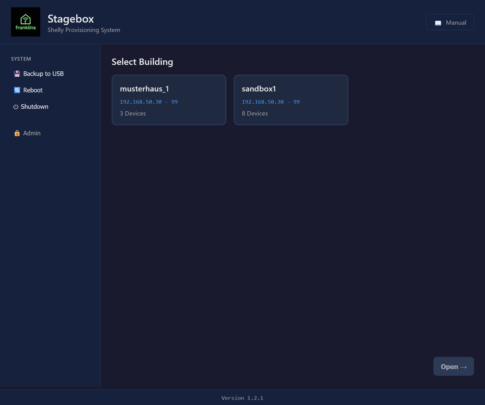
<div style="page-break-before: always;"></div>
### 1.4 Accesso come Admin

Le funzioni amministrative sono protette da un PIN. Il PIN predefinito è **0000**.

1. Cliccare su **🔒 Admin** nella sezione Admin
2. Inserire il PIN (predefinito: `0000`)
3. Cliccare su **Conferma**

Ora siete connessi come Admin (visualizzato come 🔓 Admin).

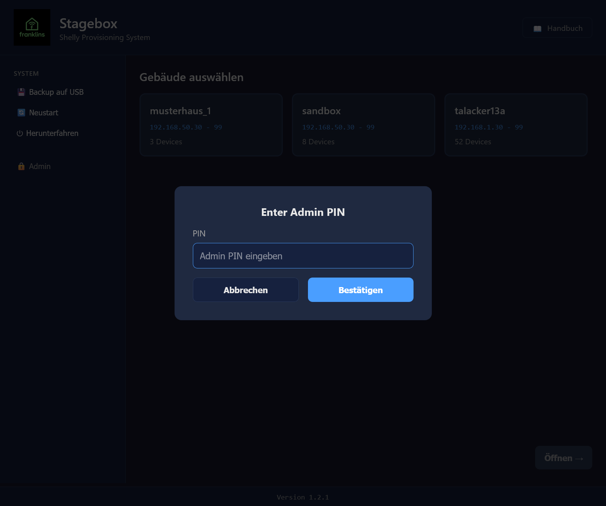

> **Raccomandazione di sicurezza:** Modificare il PIN predefinito immediatamente dopo il primo accesso (vedere sezione 1.7).
<div style="page-break-before: always;"></div>

### 1.5 Creazione del primo edificio

Un «edificio» nella Stagebox rappresenta un progetto o un sito di installazione. Ogni edificio ha il proprio database dispositivi, pool IP e configurazione.

1. Assicurarsi di essere connessi come Admin (🔓 Admin visibile)
2. Cliccare su **➕ Nuovo edificio**
3. Inserire un nome edificio (es. `casa_cliente`)
   - Utilizzare solo lettere minuscole, numeri e trattini bassi
   - Spazi e caratteri speciali vengono convertiti automaticamente
4. Cliccare su **Crea**

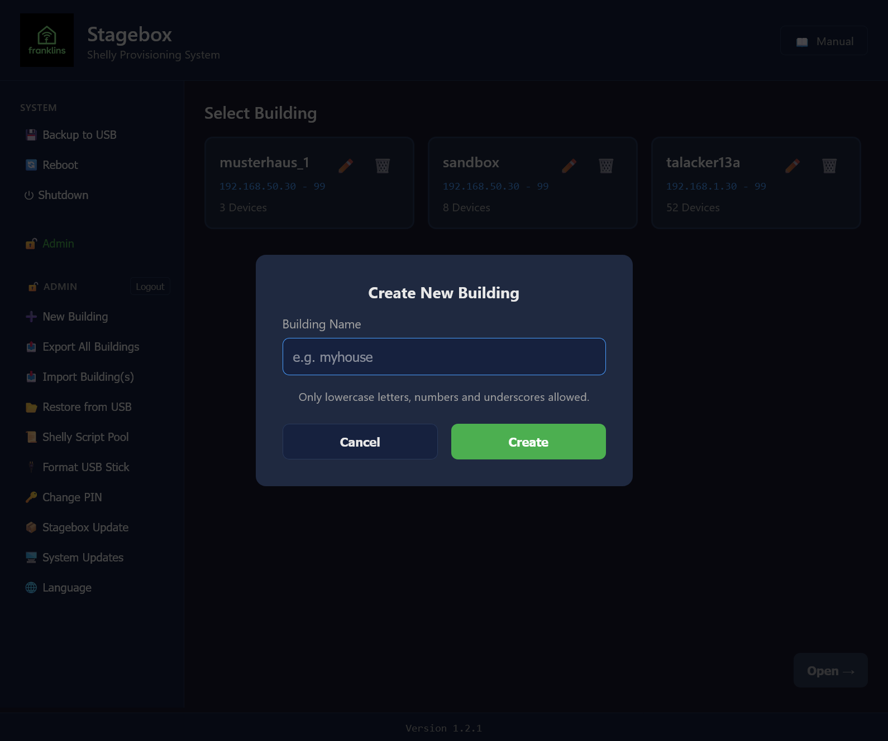

L'edificio viene creato e **si apre automaticamente** con il dialogo di configurazione WiFi.

---

> ⚠️ **CRITICO: Configurare correttamente le impostazioni WiFi!**
>
> Le impostazioni WiFi inserite qui determinano a quale rete si connetteranno i dispositivi Shelly. **Impostazioni errate renderanno i dispositivi irraggiungibili!**
>
> - Verificare l'ortografia del SSID (sensibile a maiuscole/minuscole!)
> - Verificare che la password sia corretta
> - Assicurarsi che gli intervalli IP corrispondano alla rete reale
>
> I dispositivi provisionati con credenziali WiFi errate devono essere reimpostati e riprovisionati.

<div style="page-break-before: always;"></div>

### 1.6 Configurazione WiFi e intervalli IP

Dopo la creazione di un edificio, il dialogo **Impostazioni edificio** appare automaticamente.

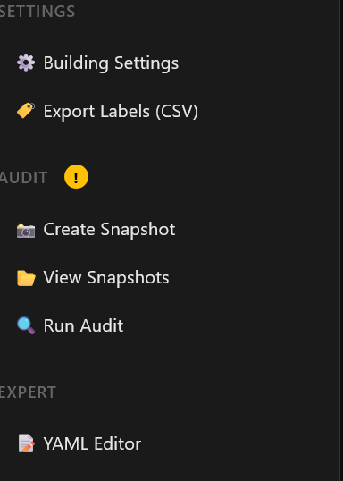

#### Configurazione WiFi

Inserire le credenziali WiFi a cui i dispositivi Shelly devono connettersi:

**WiFi principale (obbligatorio):**
- SSID: Il nome della rete (es. `HomeNetwork`)
- Password: La password WiFi

**WiFi di riserva (opzionale):**
- Una rete di backup se quella principale non è disponibile

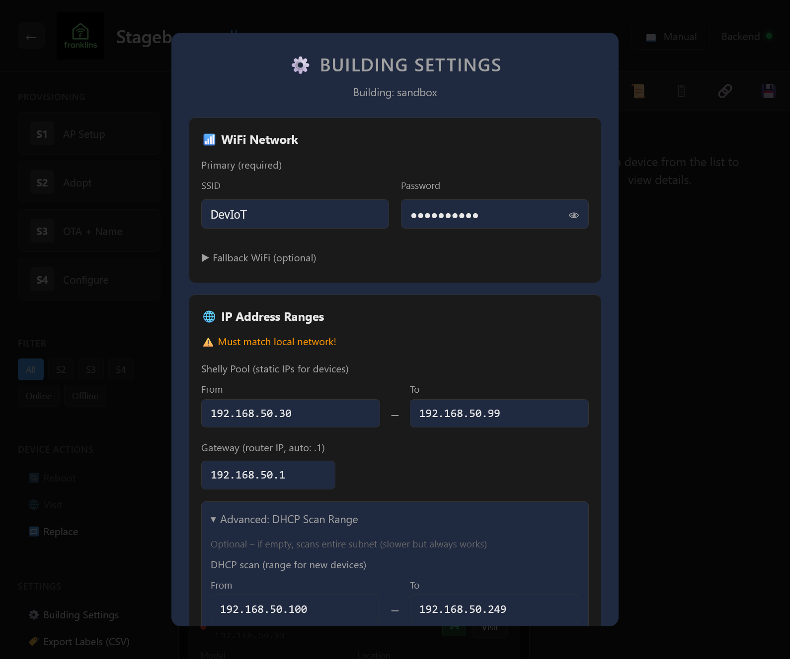

#### Intervalli di indirizzi IP

Configurare il pool di IP statici per i dispositivi Shelly:

**Pool Shelly:**
- Da: Primo IP per i dispositivi (es. `192.168.1.50`)
- A: Ultimo IP per i dispositivi (es. `192.168.1.99`)

**Gateway:**
- Solitamente l'IP del router (es. `192.168.1.1`)
- Lasciare vuoto per il rilevamento automatico (.1)

**Intervallo scansione DHCP (opzionale):**
- Intervallo in cui appaiono i nuovi dispositivi dopo un ripristino di fabbrica
- Lasciare vuoto per scansionare l'intera subnet (più lento)

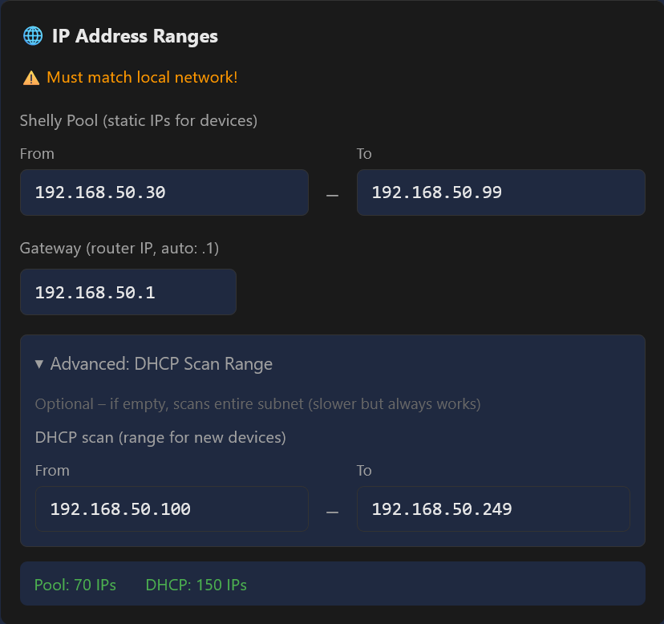

> **Avvertenza:** Gli intervalli IP devono corrispondere alla rete reale! I dispositivi saranno irraggiungibili se configurati con una subnet errata.

5. Cliccare su **💾 Salva**

<div style="page-break-before: always;"></div>

### 1.7 Modifica del PIN Admin

Per modificare il PIN Admin (predefinito `0000`):

1. Cliccare su **🔓 Admin** (deve essere connesso)
2. Cliccare su **🔑 Modifica PIN**
3. Inserire il nuovo PIN (minimo 4 cifre)
4. Confermare il nuovo PIN
5. Cliccare su **Salva**

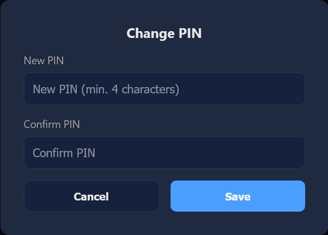

> **Importante:** Ricordare questo PIN! Protegge tutte le funzioni amministrative, inclusa l'eliminazione di edifici e le impostazioni di sistema.

### 1.8 Passi successivi

La Stagebox è ora pronta per il provisioning dei dispositivi. Proseguire con la Parte 2 per saperne di più su:
- Provisioning di nuovi dispositivi Shelly (Stage 1–4)
- Gestione dei dispositivi
- Creazione di backup

---

<div style="page-break-before: always;"></div>

## Parte 2: Riferimento funzioni

### 2.1 Pagina di benvenuto (Selezione edificio)

La pagina di benvenuto è il punto di partenza dopo l'accesso alla Stagebox. Mostra tutti gli edifici e fornisce le funzioni di sistema.

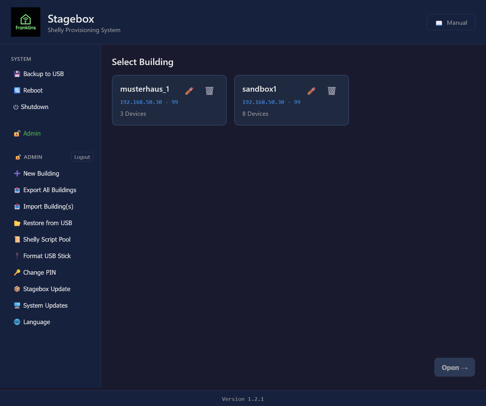

#### 2.1.1 Lista edifici

L'area centrale mostra tutti gli edifici disponibili sotto forma di schede.

Ogni scheda edificio mostra:
- Nome dell'edificio
- Riepilogo intervallo IP
- Numero di dispositivi

**Azioni (solo modalità Admin):**
- ✏️ Rinominare edificio
- 🗑️ Eliminare edificio

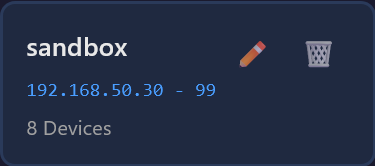

**Selezione di un edificio:**
- Clic singolo per selezionare
- Doppio clic per aprire direttamente
- Cliccare su **Apri →** dopo la selezione

#### 2.1.2 Sezione Sistema

Situata a sinistra della lista edifici:

| Pulsante | Funzione | Admin richiesto |
|----------|----------|----------------|
| 💾 Backup su USB | Creare un backup di tutti gli edifici su chiavetta USB | No |
| 🔄 Riavvia | Riavviare la Stagebox | No |
| ⏻ Spegni | Spegnere la Stagebox in sicurezza | No |

> **Importante:** Utilizzare sempre **Spegni** prima di scollegare l'alimentazione per evitare la corruzione dei dati.

#### 2.1.3 Sezione Admin

Funzioni amministrative (richiede il PIN Admin):

| Pulsante | Funzione |
|----------|----------|
| 🔒/🔓 Admin | Accesso/Disconnessione |
| ➕ Nuovo edificio | Creare un nuovo edificio |
| 📤 Esporta tutti gli edifici | Scaricare un ZIP di tutti gli edifici |
| 📥 Importa edificio/i | Importare da file ZIP |
| 📜 Shelly Script Pool | Gestire gli script condivisi |
| 📂 Ripristina da USB | Ripristinare edifici da backup USB |
| 🔌 Formatta chiavetta USB | Preparare la chiavetta USB per i backup |
| 🔑 Modifica PIN | Modificare il PIN Admin |
| 📦 Aggiornamento Stagebox | Verificare aggiornamenti software |
| 🖥️ Aggiornamenti sistema | Verificare aggiornamenti OS |
| 🌐 Lingua | Cambiare la lingua dell'interfaccia |
| 🏢 Profilo installatore | Configurare le informazioni aziendali per i rapporti |


#### 2.1.4 Backup USB

**Creazione di un backup:**

1. Inserire una chiavetta USB (qualsiasi formato)
2. Se non formattata per Stagebox: Cliccare su **🔌 Formatta chiavetta USB** (Admin)
3. Cliccare su **💾 Backup su USB**
4. Attendere il messaggio di completamento
5. La chiavetta USB può ora essere rimossa in sicurezza

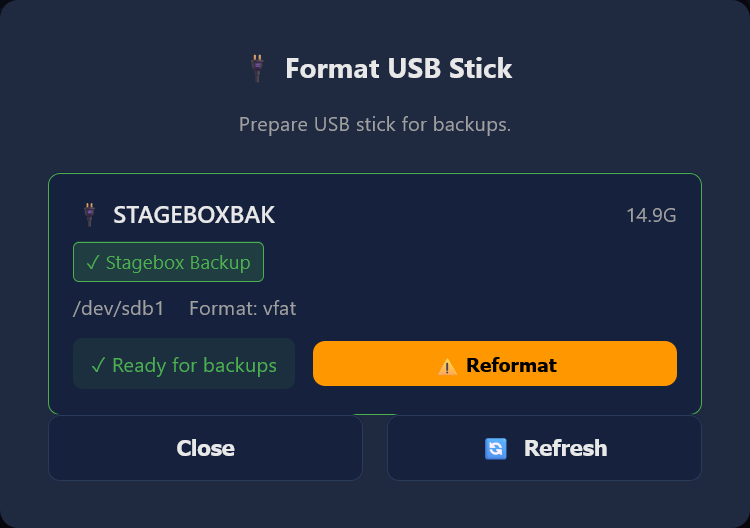

**Ripristino da USB:**

1. Inserire la chiavetta USB con i backup
2. Cliccare su **📂 Ripristina da USB** (Admin)
3. Selezionare un backup dalla lista
4. Scegliere gli edifici da ripristinare
5. Cliccare su **Ripristina selezionati**

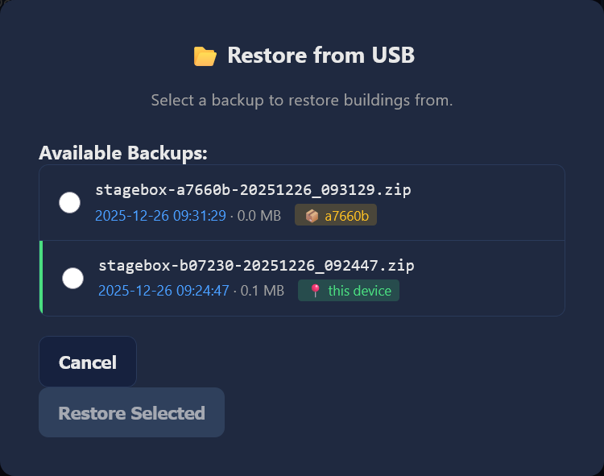

#### 2.1.5 Esporta/Importa edifici

**Esportazione:**
1. Cliccare su **📤 Esporta tutti gli edifici** (Admin)
2. Viene scaricato un file ZIP contenente tutti i dati degli edifici

**Importazione:**
1. Cliccare su **📥 Importa edificio/i** (Admin)
2. Trascinare un file ZIP o cliccare per selezionare
3. Scegliere gli edifici da importare
4. Selezionare l'azione per gli edifici esistenti (ignora/sovrascrivi)
5. Cliccare su **Importa selezionati**

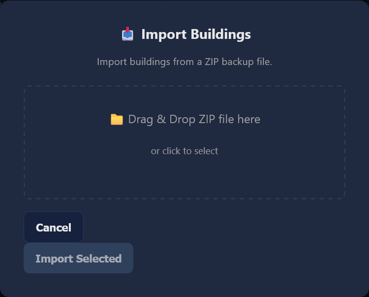

<div style="page-break-before: always;"></div>

### 2.2 Pagina edificio

La pagina edificio è l'area di lavoro principale per il provisioning e la gestione dei dispositivi in un edificio specifico.

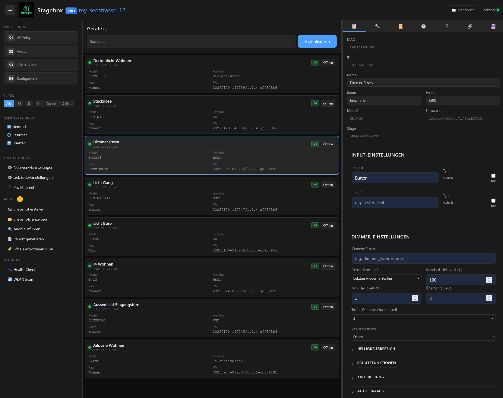

#### Layout:
- **Barra laterale sinistra:** Fasi di provisioning, filtri, azioni, impostazioni
- **Area centrale:** Lista dispositivi
- **Barra laterale destra:** Pannelli Stage o dettagli dispositivo, schede Script, KVS, Webhook, Pianificazione e OTA

### 2.3 Barra laterale sinistra

#### 2.3.1 Intestazione edificio

Mostra il nome dell'edificio corrente. Cliccare per tornare alla pagina di benvenuto.
<div style="page-break-before: always;"></div>

#### 2.3.2 Fasi di provisioning

La pipeline di provisioning in 4 fasi:

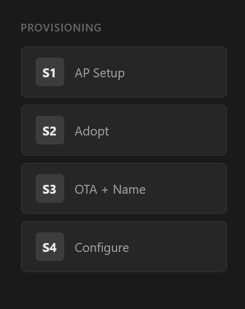

**S1 — Provisioning AP:**
- Cerca dispositivi Shelly in modalità AP (Access Point)
- Configura le credenziali WiFi
- Disattiva cloud, BLE e modalità AP

**S2 — Adozione:**
- Scansiona la rete per nuovi dispositivi (intervallo DHCP)
- Assegna IP statici dal pool
- Registra i dispositivi nel database

**S3 — OTA & Nomi:**
- Aggiorna il firmware all'ultima versione
- Sincronizza i nomi descrittivi sui dispositivi

**S4 — Configurazione:**
- Applica i profili dispositivo
- Configura ingressi, interruttori, tapparelle, ecc.

<div style="page-break-before: always;"></div>

#### 2.3.3 Stage 1: Provisioning AP

1. Cliccare sul pulsante **S1**
2. L'adattatore WiFi della Stagebox cerca gli AP Shelly
3. I dispositivi trovati vengono configurati automaticamente, il contatore dispositivi si incrementa
4. Cliccare su **⏹ Stop** quando terminato

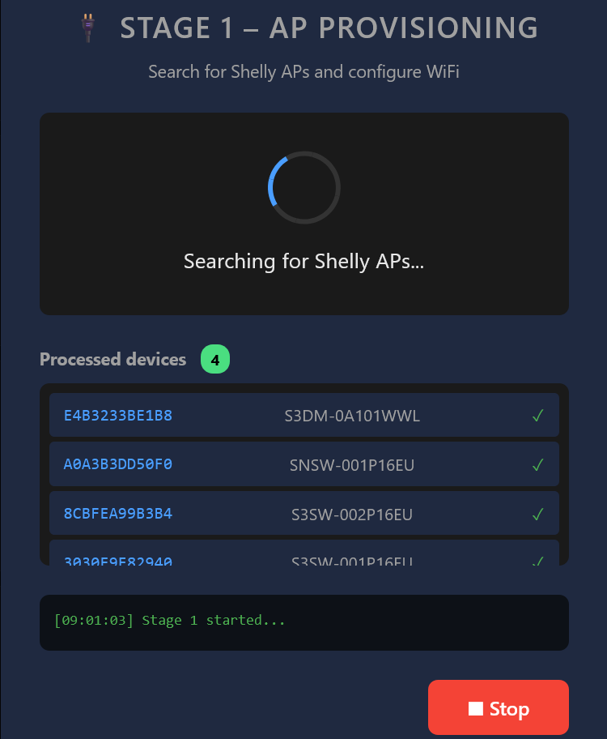

> **Suggerimento:** Mettere i dispositivi Shelly in modalità AP tenendo premuto il pulsante per 10+ secondi o eseguendo un ripristino di fabbrica.

<div style="page-break-before: always;"></div>

#### 2.3.4 Stage 2: Adozione

1. Cliccare sul pulsante **S2**
2. Cliccare su **Scansiona rete**
3. I nuovi dispositivi appaiono nella lista
4. Selezionare i dispositivi da adottare o cliccare su **Adotta tutti**
5. I dispositivi ricevono IP statici e vengono registrati

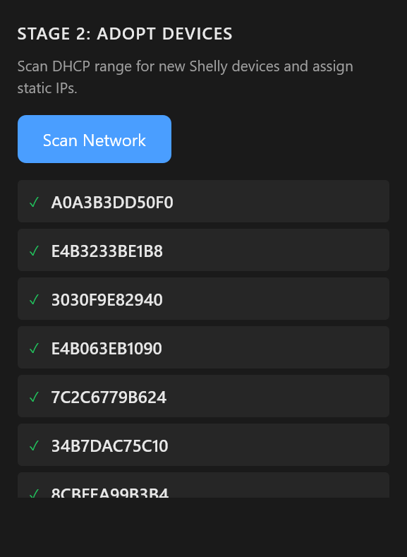

<div style="page-break-before: always;"></div>

#### 2.3.5 Stage 3: OTA & Nomi

1. Cliccare sul pulsante **S3**
2. I dispositivi allo Stage 2 vengono elencati
3. Cliccare su **Esegui Stage 3** per:
   - Aggiornare il firmware (se disponibile una versione più recente)
   - Sincronizzare i nomi descrittivi dal database ai dispositivi

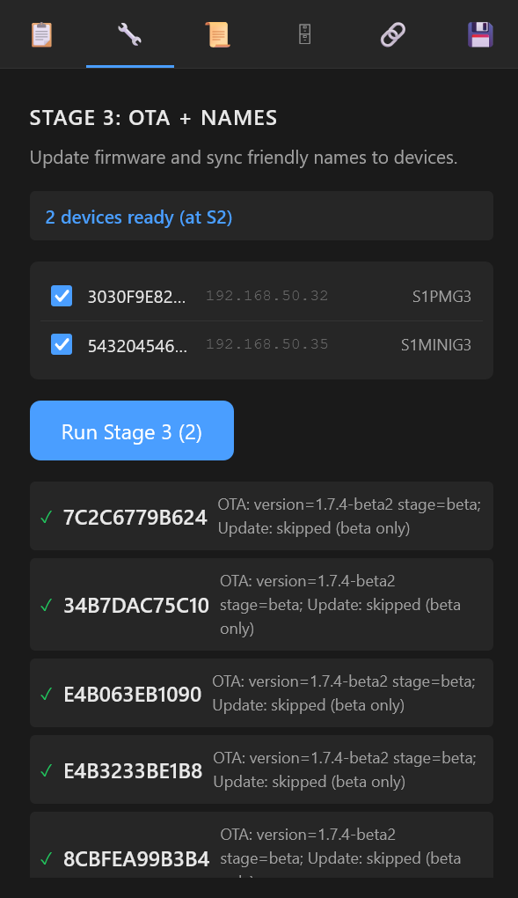

<div style="page-break-before: always;"></div>

#### 2.3.6 Stage 4: Configurazione

1. Cliccare sul pulsante **S4**
2. I dispositivi allo Stage 3 vengono elencati
3. Cliccare su **Esegui Stage 4** per applicare i profili:
   - Impostazioni interruttore (stato iniziale, spegnimento automatico)
   - Impostazioni tapparella (inversione direzione, limiti)
   - Configurazioni ingresso
   - Azioni personalizzate

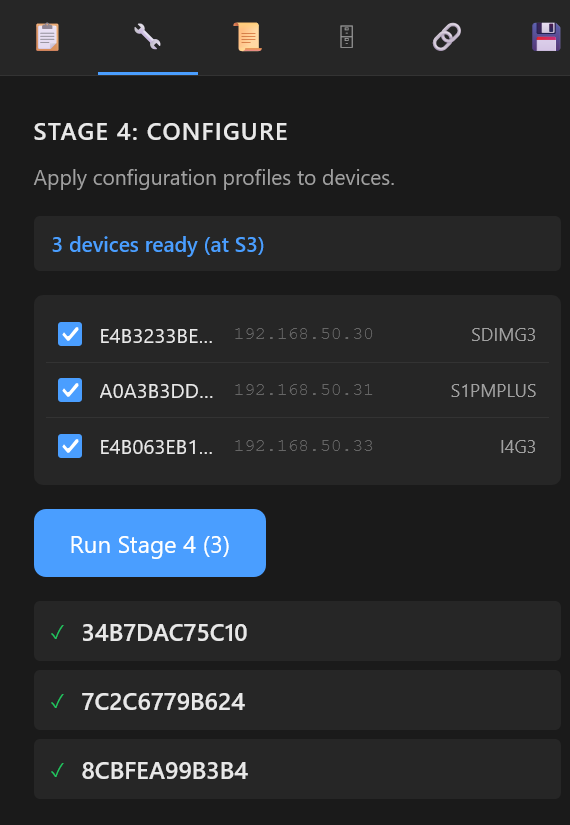

<div style="page-break-before: always;"></div>

#### 2.3.7 Filtri

Filtrare la lista dispositivi secondo vari criteri:

| Filtro | Descrizione |
|--------|-------------|
| Stage | Mostrare i dispositivi in una fase di provisioning specifica |
| Stanza | Mostrare i dispositivi in una stanza specifica |
| Modello | Mostrare tipi di dispositivi specifici |
| Stato | Dispositivi online/offline |

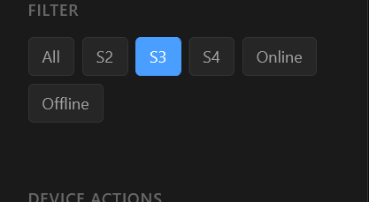

#### 2.3.8 Azioni

Operazioni in massa sui dispositivi selezionati:

| Azione | Descrizione |
|--------|-------------|
| 🔄 Aggiorna | Aggiornare lo stato dei dispositivi |
| 📋 Copia | Copiare le info del dispositivo negli appunti |
| 📤 Esporta CSV | Esportare i dispositivi selezionati |
| 🗑️ Rimuovi | Rimuovere dal database (Admin) |

<div style="page-break-before: always;"></div>

### 2.4 Lista dispositivi

L'area centrale mostra tutti i dispositivi nell'edificio corrente.


#### Colonne:

| Colonna | Descrizione |
|---------|-------------|
| ☑️ | Casella di selezione |
| Stato | Online (🟢) / Offline (🔴) |
| Nome | Nome descrittivo del dispositivo |
| Stanza | Stanza assegnata |
| Posizione | Posizione nella stanza |
| Modello | Tipo di dispositivo |
| IP | Indirizzo IP attuale |
| Stage | Fase di provisioning attuale (S1–S4) |

#### Selezione:
- Cliccare sulla casella per selezionare singoli dispositivi
- Cliccare sulla casella dell'intestazione per selezionare tutti i visibili
- Shift+clic per selezione a intervallo

#### Ordinamento:
- Cliccare sull'intestazione della colonna per ordinare
- Cliccare nuovamente per invertire l'ordine

<div style="page-break-before: always;"></div>

### 2.5 Barra laterale destra (Dettagli dispositivo)

Quando un dispositivo è selezionato, la barra laterale destra mostra informazioni dettagliate e azioni.

#### 2.5.1 Scheda Info dispositivo

Informazioni di base sul dispositivo:

| Campo | Descrizione |
|-------|-------------|
| Nome | Nome descrittivo modificabile |
| Stanza | Assegnazione stanza (modificabile) |
| Posizione | Posizione nella stanza (modificabile) |
| MAC | Indirizzo hardware |
| IP | Indirizzo di rete |
| Modello | Modello hardware |
| Firmware | Versione attuale |

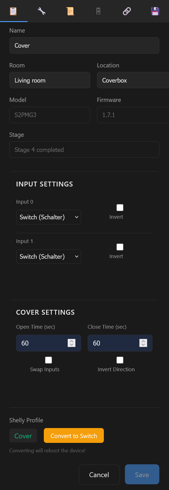

<div style="page-break-before: always;"></div>

#### 2.5.2 Scheda Scripts

Gestire gli script sul dispositivo selezionato:

- Visualizzare gli script installati
- Avviare/arrestare gli script
- Rimuovere gli script
- Distribuire nuovi script

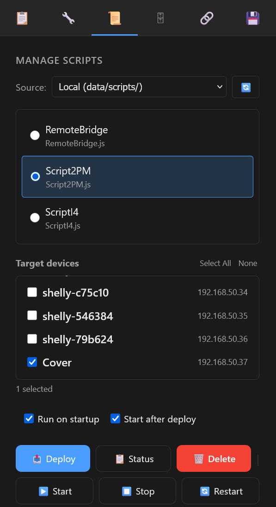

#### 2.5.3 Scheda KVS

Visualizzare e modificare le voci del Key-Value Store:

- Valori di sistema (sola lettura)
- Valori utente (modificabili)
- Aggiungere nuove voci
- Eliminare voci

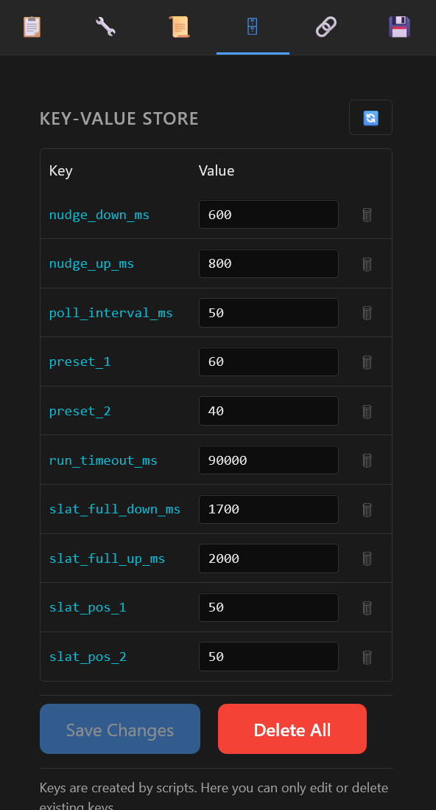
<div style="page-break-before: always;"></div>

#### 2.5.4 Scheda Webhooks

Configurare i webhook del dispositivo:

- Visualizzare i webhook esistenti
- Aggiungere nuovi webhook
- Modificare URL e condizioni
- Eliminare webhook

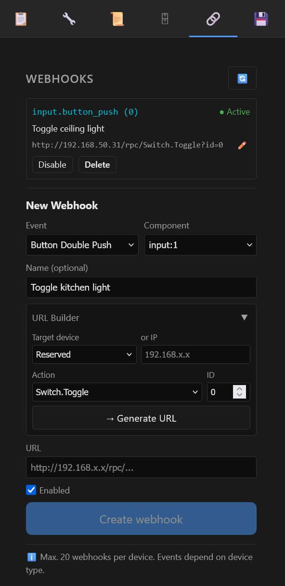
<div style="page-break-before: always;"></div>

#### 2.5.5 Scheda Pianificazioni

La scheda Pianificazioni consente di creare, gestire e distribuire automazioni temporizzate sui dispositivi Shelly. Le pianificazioni vengono salvate come modelli e possono essere distribuite contemporaneamente su più dispositivi compatibili.


**Panoramica della scheda:**

La scheda Pianificazioni è suddivisa in tre aree:

1. **Lista modelli** — modelli di pianificazione salvati con controlli di modifica/eliminazione
2. **Dispositivi di destinazione** — lista di caselle per selezionare le destinazioni di distribuzione
3. **Pulsanti azione** — Distribuisci, Stato e Elimina tutto

##### Creare una pianificazione

1. Cliccare su **+ Nuovo** per aprire l'editor di pianificazione
2. Inserire un **Nome** e una **Descrizione** opzionale

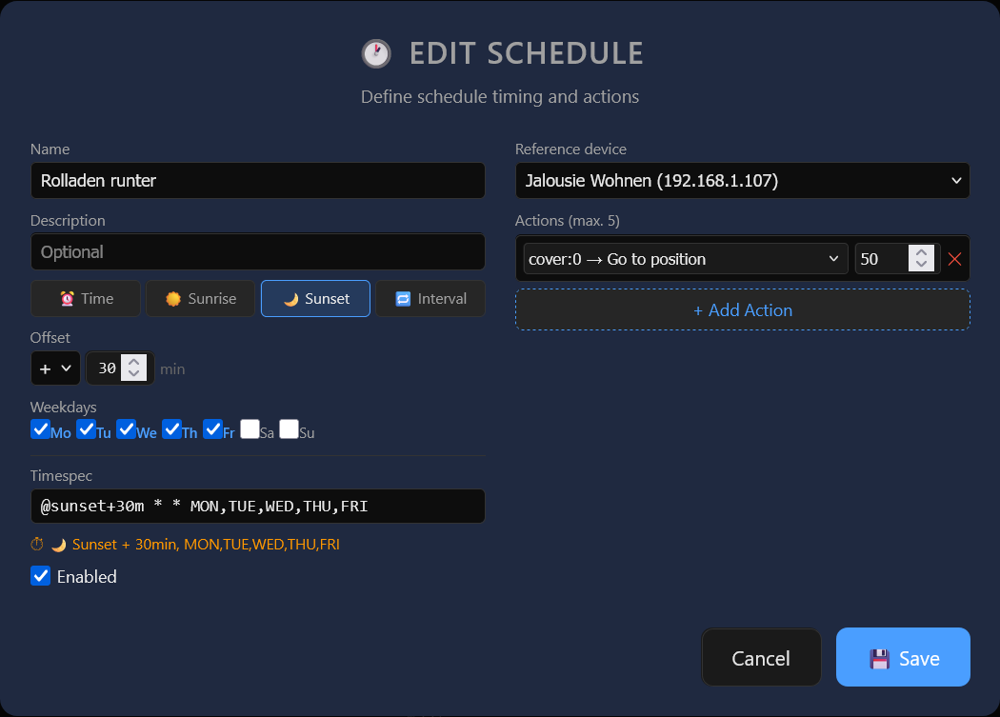

**Colonna sinistra — Temporizzazione:**

Selezionare una delle quattro modalità di temporizzazione:

| Modalità | Descrizione |
|----------|-------------|
| 🕐 **Orario** | Impostare un orario specifico della giornata (ore e minuti) |
| 🌅 **Alba** | Attivazione all'alba, con offset opzionale |
| 🌇 **Tramonto** | Attivazione al tramonto, con offset opzionale |
| 📅 **Intervallo** | Ripetizione a intervalli regolari — scegliere tra preimpostazioni (ogni 5 min, 15 min, 30 min, ogni ora, ogni 2 ore) o inserire valori personalizzati in minuti/ore |

Sotto la modalità di temporizzazione, selezionare i **giorni della settimana** tramite le caselle (lun–dom).

Il campo **timespec** mostra l'espressione cron Shelly generata (sola lettura). Sotto viene visualizzata un'anteprima dei prossimi orari di esecuzione pianificati.

La casella **Attivato** controlla se la pianificazione è attiva dopo la distribuzione.

**Colonna destra — Azioni:**

3. Selezionare un **Dispositivo di riferimento** dal menu a tendina — Stagebox interroga questo dispositivo per determinare i componenti e le azioni disponibili (es. Switch, Cover, Light)
4. Aggiungere una o più **Azioni** (fino a 5 per pianificazione) cliccando su **+ Aggiungi azione**:
   - I metodi disponibili dipendono dai componenti del dispositivo di riferimento
   - Esempi: `Switch.Set` (on/off), `Cover.GoToPosition` (0–100), `Light.Set` (on/off/luminosità)
   - Rimuovere un'azione con il pulsante **✕**

5. Cliccare su **💾 Salva** per salvare il modello, o **Annulla** per annullare

> **Suggerimento:** Il dispositivo di riferimento determina quali azioni sono disponibili. Scegliere un dispositivo che possiede i componenti che si desidera controllare.

##### Modificare una pianificazione

- Cliccare sul pulsante **✏️ Modifica** accanto a un modello, o **fare doppio clic** sul nome del modello
- L'editor di pianificazione si apre precompilato con le impostazioni esistenti
- Modificare e cliccare su **💾 Salva**

##### Distribuire le pianificazioni

1. Selezionare un modello di pianificazione dalla lista
2. Spuntare i dispositivi di destinazione nella sezione **Dispositivi di destinazione**
   - Utilizzare **Seleziona tutti** / **Nessuno** per una selezione rapida
   - I dispositivi incompatibili (componenti richiesti mancanti) vengono automaticamente ignorati durante la distribuzione
3. Cliccare su **📤 Distribuisci**
4. I risultati vengono mostrati per dispositivo con stato successo/fallimento

> **Nota:** Prima della distribuzione, Stagebox verifica ogni dispositivo di destinazione per i componenti richiesti. I dispositivi privi dei componenti necessari (es. distribuire una pianificazione Cover su un dispositivo solo Switch) vengono ignorati con un messaggio di errore.

##### Verificare lo stato delle pianificazioni

1. Selezionare i dispositivi di destinazione
2. Cliccare su **📋 Stato**
3. Stagebox interroga ogni dispositivo e mostra le pianificazioni attualmente installate, inclusi timespec, metodo e stato attivato/disattivato

##### Eliminare le pianificazioni dai dispositivi

1. Selezionare i dispositivi di destinazione
2. Cliccare su **🗑️ Elimina tutto**
3. Tutte le pianificazioni sui dispositivi selezionati vengono rimosse

> **Avvertenza:** «Elimina tutto» rimuove **tutte** le pianificazioni dai dispositivi selezionati, non solo quelle distribuite da Stagebox.

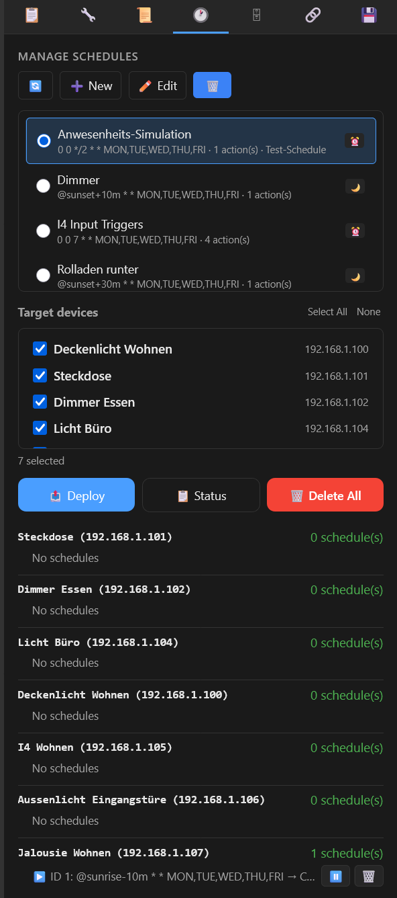
<div style="page-break-before: always;"></div>

#### 2.5.6 Scheda Componenti virtuali

Configurare i componenti virtuali sui dispositivi:

- Interruttori virtuali
- Sensori virtuali
- Componenti testo
- Componenti numero


#### 2.5.7 Scheda Aggiornamenti FW

Gestire il firmware dei dispositivi:

- Visualizzare la versione attuale
- Verificare aggiornamenti
- Applicare aggiornamenti firmware

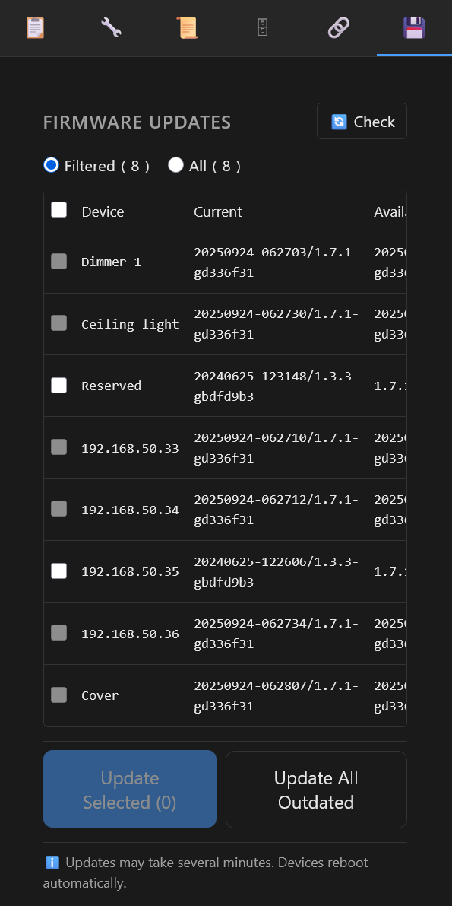
<div style="page-break-before: always;"></div>

### 2.6 Gestione script

#### 2.6.1 Script Pool (Admin)

Gestire gli script condivisi disponibili per la distribuzione:

1. Andare alla pagina di benvenuto
2. Cliccare su **📜 Shelly Script Pool** (Admin)
3. Caricare file JavaScript (.js)
4. Eliminare gli script non utilizzati

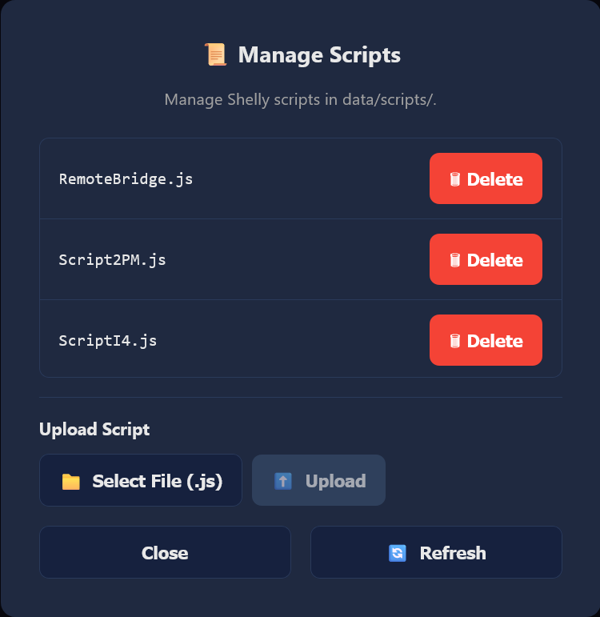
<div style="page-break-before: always;"></div>

#### 2.6.2 Distribuzione script

1. Selezionare il/i dispositivo/i di destinazione nella lista dispositivi
2. Andare alla scheda **Scripts**
3. Selezionare la fonte: **Locale** (Script Pool) o **Libreria GitHub**
4. Scegliere uno script
5. Configurare le opzioni:
   - ☑️ Eseguire all'avvio
   - ☑️ Avviare dopo la distribuzione
6. Cliccare su **📤 Distribuisci**

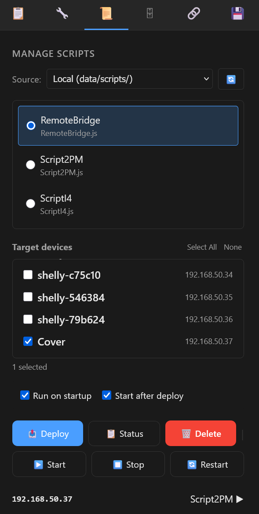

<div style="page-break-before: always;"></div>

### 2.7 Impostazioni Esperto (Avanzate)

> ⚠️ **Avvertenza:** Le impostazioni Esperto consentono la configurazione diretta del comportamento di provisioning e dei parametri di sistema. Modifiche errate possono compromettere il provisioning dei dispositivi. Utilizzare con cautela!

Accesso tramite la sezione **Esperto** → **⚙️ Impostazioni edificio** nella barra laterale della pagina edificio.

Il dialogo Impostazioni edificio fornisce un'interfaccia a schede per configurare le opzioni avanzate.

---

#### 2.7.1 Scheda Provisioning

Controlla il comportamento del provisioning Stage 1 (modalità AP).

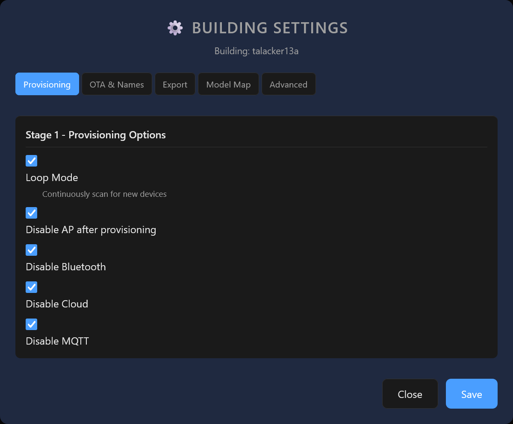

| Impostazione | Descrizione | Predefinito |
|--------------|-------------|-------------|
| **Modalità ciclo** | Ricerca continua di nuovi dispositivi. Quando attivato, Stage 1 continua a cercare nuovi AP Shelly dopo ogni provisioning riuscito. Disattivare per il provisioning di un singolo dispositivo. | ☑️ Attivo |
| **Disattivare AP dopo provisioning** | Spegnere l'Access Point WiFi del dispositivo dopo la connessione alla rete. Raccomandato per la sicurezza. | ☑️ Attivo |
| **Disattivare Bluetooth** | Spegnere il Bluetooth sui dispositivi provisionati. Risparmia energia e riduce la superficie di attacco. | ☑️ Attivo |
| **Disattivare Cloud** | Disattivare la connettività Shelly Cloud. I dispositivi saranno accessibili solo localmente. | ☑️ Attivo |
| **Disattivare MQTT** | Spegnere il protocollo MQTT sui dispositivi. Attivare se si utilizza un sistema domotico con MQTT. | ☑️ Attivo |

---

#### 2.7.2 Scheda OTA & Nomi

Configurare il comportamento degli aggiornamenti firmware e la gestione dei nomi descrittivi durante lo Stage 3.

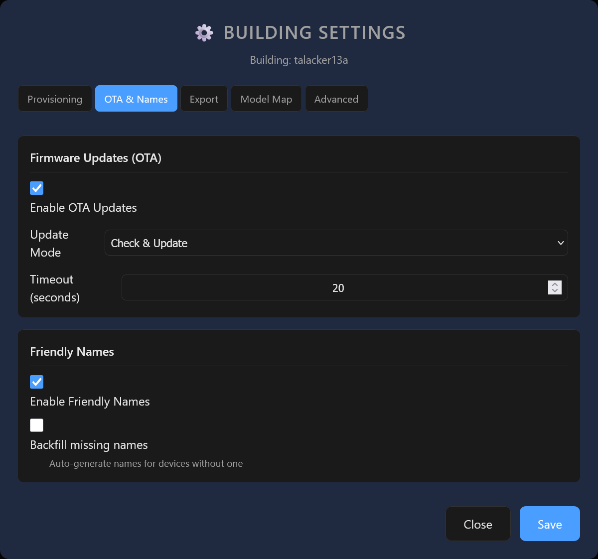

**Aggiornamenti firmware (OTA):**

| Impostazione | Descrizione | Predefinito |
|--------------|-------------|-------------|
| **Attivare aggiornamenti OTA** | Verificare e opzionalmente installare aggiornamenti firmware durante lo Stage 3. | ☑️ Attivo |
| **Modalità aggiornamento** | `Solo verifica`: Segnalare gli aggiornamenti disponibili senza installarli. `Verifica & aggiorna`: Installare automaticamente gli aggiornamenti disponibili. | Solo verifica |
| **Timeout (secondi)** | Tempo di attesa massimo per le operazioni OTA. Aumentare per reti lente. | 20 |

**Nomi descrittivi:**

| Impostazione | Descrizione | Predefinito |
|--------------|-------------|-------------|
| **Attivare nomi descrittivi** | Applicare i nomi stanza/posizione ai dispositivi durante lo Stage 3. I nomi vengono salvati nella configurazione del dispositivo. | ☑️ Attivo |
| **Completare nomi mancanti** | Generare automaticamente nomi per i dispositivi che non ne hanno uno assegnato. Utilizza il modello `<Modello>_<Suffisso-MAC>`. | ☐ Disattivo |

<div style="page-break-before: always;"></div>

#### 2.7.3 Scheda Esportazione

Configurare le impostazioni di esportazione CSV per etichette dispositivi e rapporti.

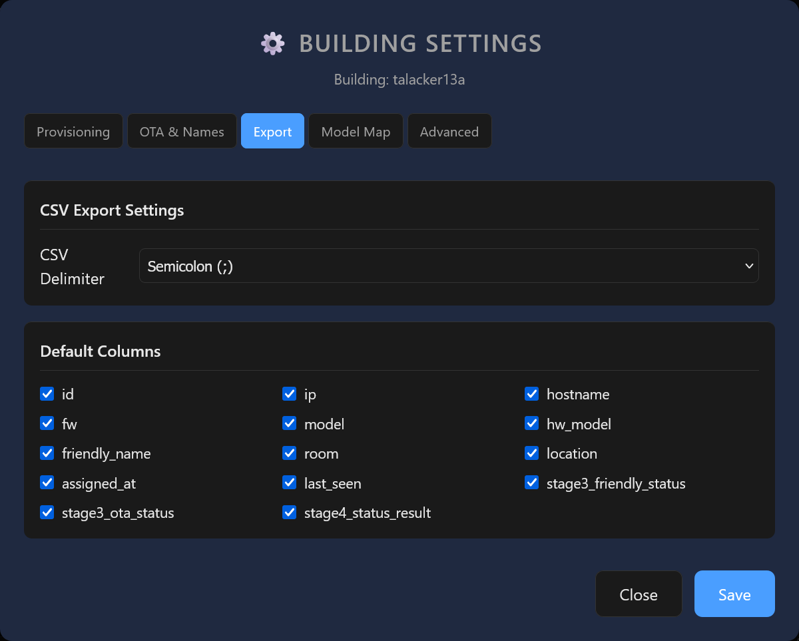

**Delimitatore CSV:**

Scegliere il separatore di colonne per i file CSV esportati:
- **Punto e virgola (;)** — Predefinito, funziona con le versioni europee di Excel
- **Virgola (,)** — Formato CSV standard
- **Tabulazione** — Per valori separati da tabulazioni

**Colonne predefinite:**

Selezionare quali colonne appaiono nei file CSV esportati. Colonne disponibili:

| Colonna | Descrizione |
|---------|-------------|
| `id` | Indirizzo MAC del dispositivo (identificatore unico) |
| `ip` | Indirizzo IP attuale |
| `hostname` | Hostname del dispositivo |
| `fw` | Versione firmware |
| `model` | Nome modello descrittivo |
| `hw_model` | ID modello hardware |
| `friendly_name` | Nome assegnato al dispositivo |
| `room` | Assegnazione stanza |
| `location` | Posizione nella stanza |
| `assigned_at` | Data di provisioning |
| `last_seen` | Ultimo timestamp di comunicazione |
| `stage3_friendly_status` | Stato assegnazione nome |
| `stage3_ota_status` | Stato aggiornamento firmware |
| `stage4_status_result` | Risultato della fase di configurazione |

<div style="page-break-before: always;"></div>

#### 2.7.4 Scheda Mappa modelli

Definire nomi di visualizzazione personalizzati per gli ID modelli hardware Shelly.

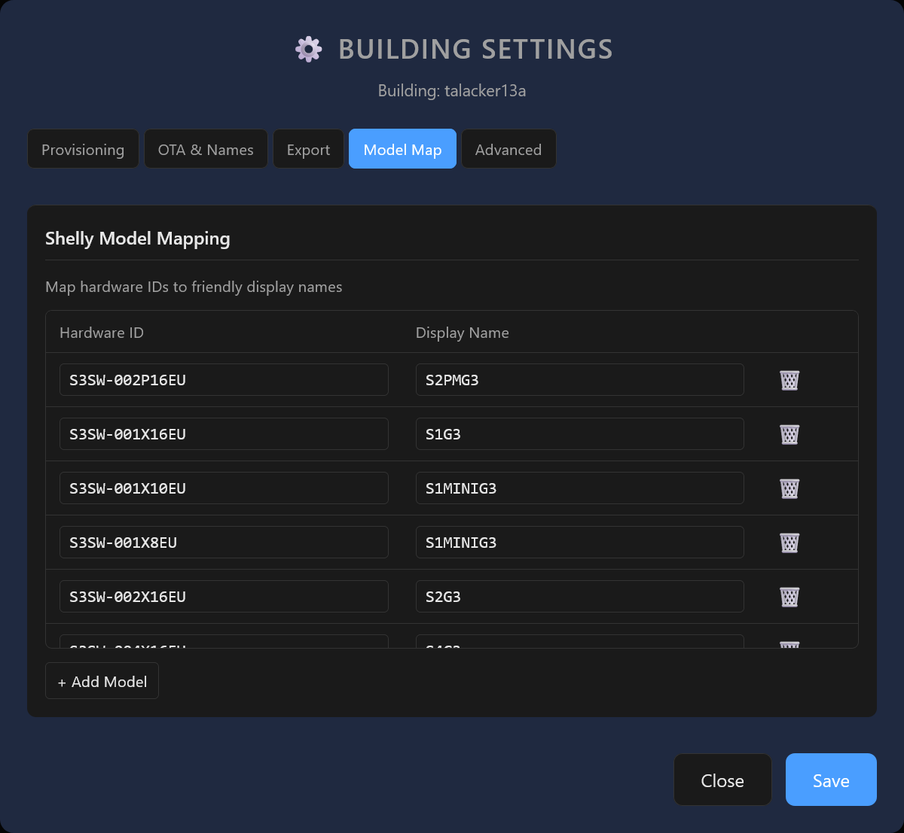

La mappa modelli traduce gli identificatori hardware interni (es. `SNSW-001X16EU`) in nomi leggibili (es. `Shelly Plus 1`).

**Utilizzo:**
1. Inserire l'**ID hardware** esattamente come riportato dal dispositivo
2. Inserire il **Nome di visualizzazione** preferito
3. Cliccare su **+ Aggiungi modello** per aggiungere altre voci
4. Cliccare su **🗑️** per rimuovere una voce

> **Suggerimento:** Verificare l'interfaccia web o la risposta API del dispositivo per trovare la stringa esatta dell'ID hardware.

<div style="page-break-before: always;"></div>

#### 2.7.5 Scheda Avanzate (Editor YAML)

Modifica diretta dei file di configurazione per scenari avanzati.

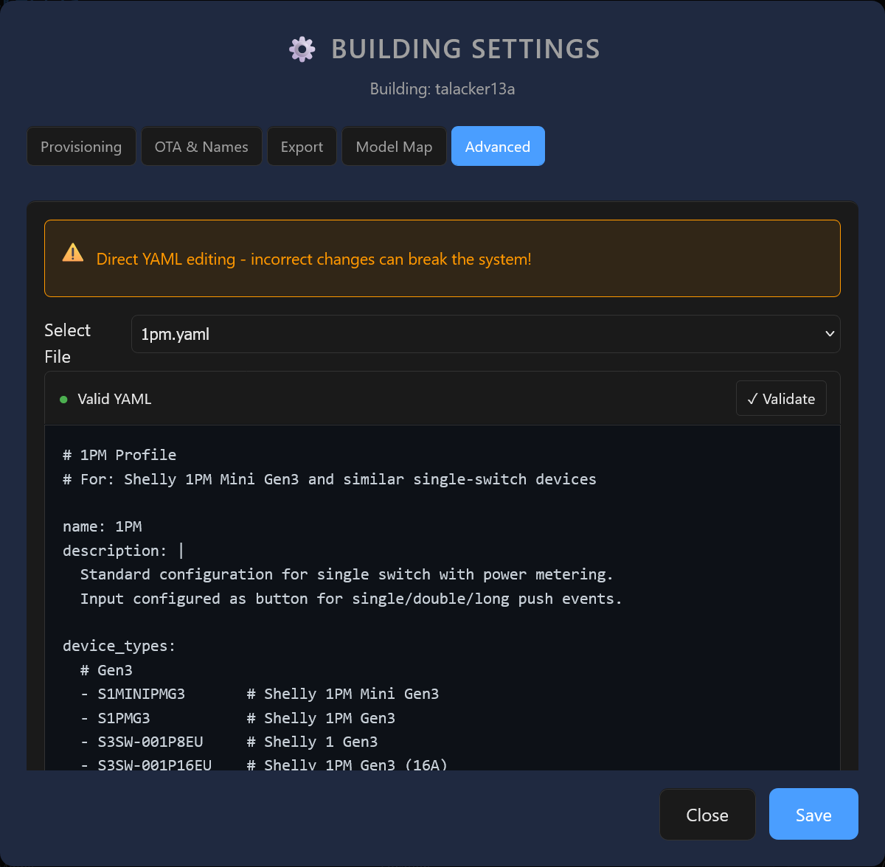

**File disponibili:**

| File | Descrizione |
|------|-------------|
| `config.yaml` | Configurazione principale dell'edificio (intervalli IP, database dispositivi, impostazioni provisioning) |
| `profiles/*.yaml` | Profili di configurazione dispositivi per lo Stage 4 |

**Funzionalità:**
- Validazione della sintassi (indicatore verde/rosso)
- Selezione file dal menu a tendina
- Modifica diretta del contenuto
- Tutte le modifiche vengono salvate automaticamente prima del salvataggio

**Indicatore di validazione:**
- 🟢 Verde: Sintassi YAML valida
- 🔴 Rosso: Errore di sintassi (dettagli al passaggio del mouse)

> **Raccomandazione:** Utilizzare le altre schede per la configurazione normale. Utilizzare l'editor YAML solo quando è necessario modificare impostazioni non esposte nell'UI, o per la risoluzione dei problemi.

<div style="page-break-before: always;"></div>

### 2.8 Manutenzione del sistema

#### 2.8.1 Aggiornamenti Stagebox

Verificare e installare gli aggiornamenti software della Stagebox:

1. Andare alla pagina di benvenuto
2. Cliccare su **📦 Aggiornamento Stagebox** (Admin)
3. Le versioni attuale e disponibile vengono mostrate
4. Cliccare su **⬇️ Installa aggiornamento** se disponibile
5. Attendere l'installazione e il riavvio automatico

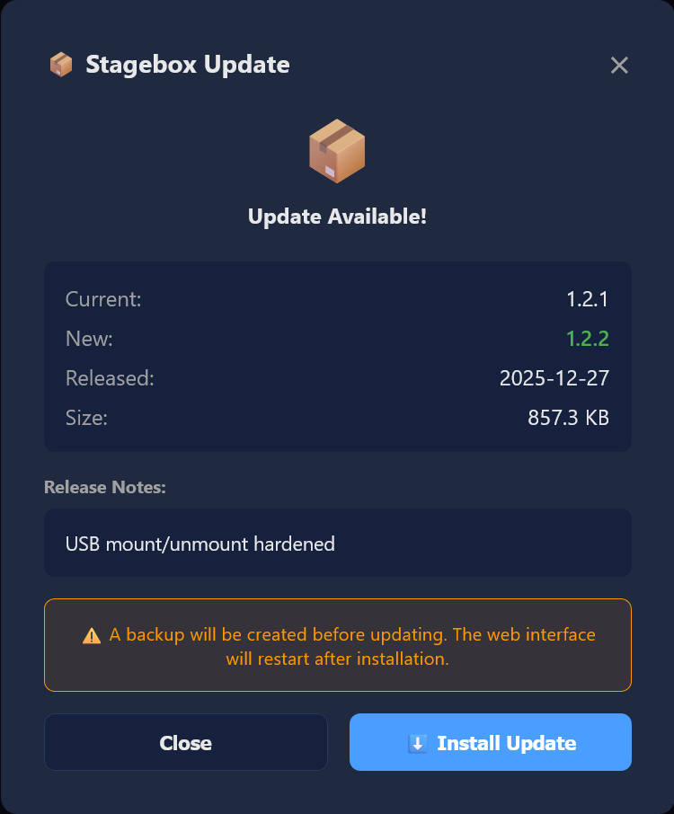
<div style="page-break-before: always;"></div>

#### 2.8.2 Aggiornamenti sistema

Verificare e installare gli aggiornamenti del sistema operativo:

1. Andare alla pagina di benvenuto
2. Cliccare su **🖥️ Aggiornamenti sistema** (Admin)
3. Gli aggiornamenti di sicurezza e sistema vengono elencati
4. Cliccare su **⬇️ Installa aggiornamenti**
5. Il sistema potrebbe riavviarsi se necessario

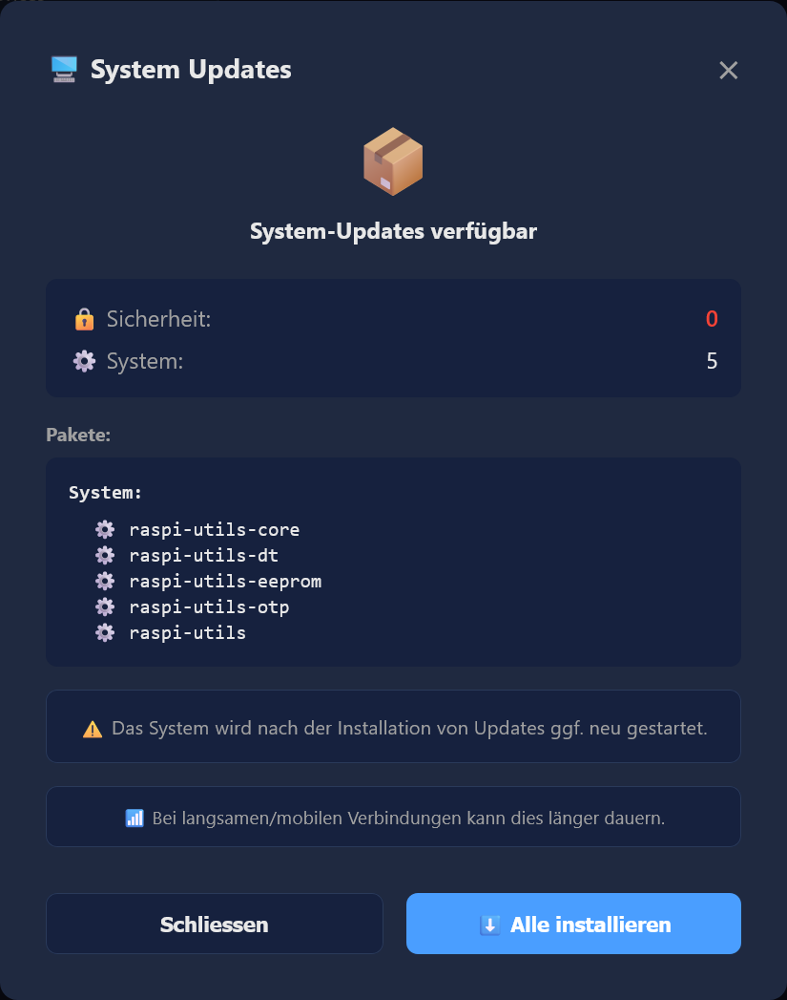

---

<div style="page-break-before: always;"></div>

### 2.9 Rapporti & Documentazione

Stagebox offre funzionalità complete di reportistica per la documentazione professionale delle installazioni. I rapporti includono inventari dispositivi, dettagli di configurazione e possono essere personalizzati con il branding dell'installatore.

#### 2.9.1 Profilo installatore

Il profilo installatore contiene le informazioni della vostra azienda che appaiono su tutti i rapporti generati. È un'impostazione globale condivisa tra tutti gli edifici.

**Accesso al profilo installatore:**

1. Andare alla pagina di benvenuto
2. Cliccare su **🏢 Profilo installatore** (Admin richiesto)

**Campi disponibili:**

| Campo | Descrizione |
|-------|-------------|
| Nome azienda | La ragione sociale |
| Indirizzo | Indirizzo postale (multi-riga supportato) |
| Telefono | Numero di telefono di contatto |
| E-mail | Indirizzo e-mail di contatto |
| Sito web | URL del sito web aziendale |
| Logo | Immagine del logo aziendale (PNG, JPG, max 2 MB) |

**Linee guida per il logo:**
- Dimensione raccomandata: 400×200 pixel o rapporto simile
- Formati: PNG (sfondo trasparente raccomandato) o JPG
- Dimensione massima: 2 MB
- Il logo appare nell'intestazione dei rapporti PDF

> **Suggerimento:** Completare il profilo installatore prima di generare il primo rapporto per garantire una documentazione professionale.

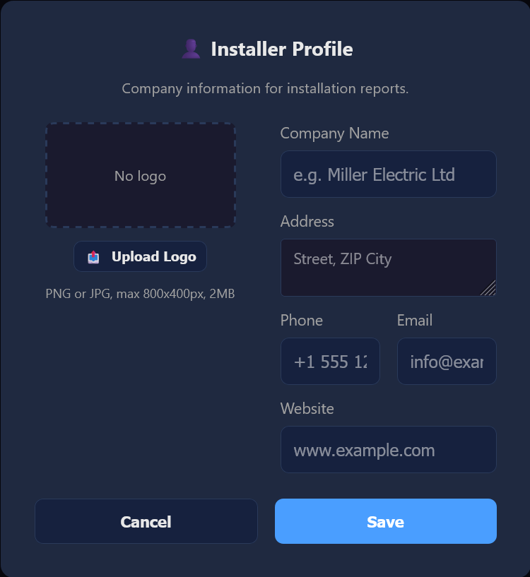

<div style="page-break-before: always;"></div>

#### 2.9.2 Profilo edificio (Informazioni oggetto)

Ogni edificio può avere il proprio profilo con informazioni specifiche del cliente e del progetto. Questi dati appaiono nei rapporti generati per quell'edificio.

**Accesso al profilo edificio:**

1. Aprire la pagina edificio
2. Andare alla sezione **Esperto** nella barra laterale
3. Cliccare su **⚙️ Impostazioni edificio**
4. Selezionare la scheda **Oggetto**

**Campi disponibili:**

| Campo | Descrizione |
|-------|-------------|
| Nome oggetto | Nome del progetto o della proprietà (es. «Villa Müller») |
| Nome cliente | Nome del cliente |
| Indirizzo | Indirizzo della proprietà (multi-riga supportato) |
| Telefono contatto | Numero di telefono del cliente |
| E-mail contatto | Indirizzo e-mail del cliente |
| Note | Note aggiuntive (appaiono nei rapporti) |

> **Nota:** Il nome oggetto viene utilizzato come titolo del rapporto. Se non impostato, viene utilizzato il nome dell'edificio.

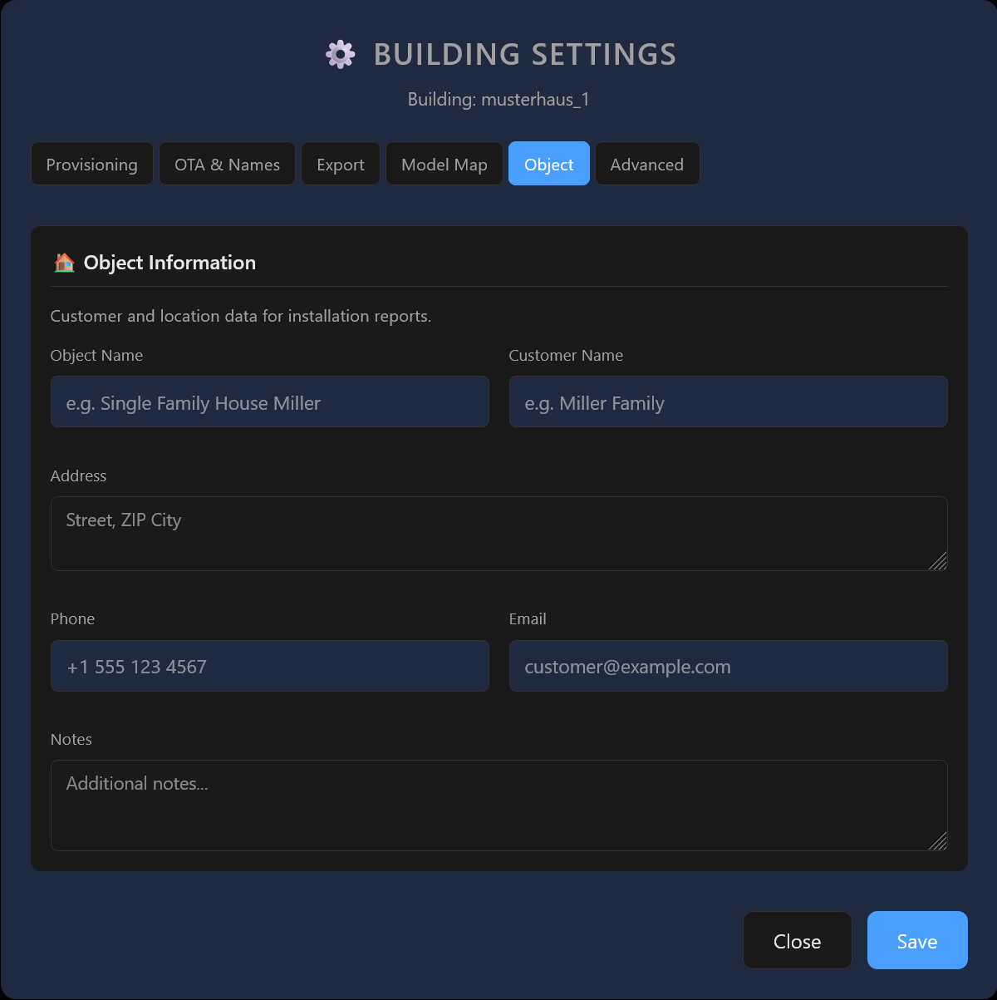

<div style="page-break-before: always;"></div>

#### 2.9.3 Snapshot

Uno snapshot cattura lo stato completo di tutti i dispositivi in un edificio in un momento specifico. Gli snapshot vengono salvati come pacchetti ZIP contenenti dati dispositivi e file di configurazione.

**Creazione di uno snapshot:**

1. Aprire la pagina edificio
2. Andare alla sezione **Audit** nella barra laterale
3. Cliccare su **📸 Snapshot**
4. Attendere il completamento della scansione

**Gestione snapshot:**

| Azione | Descrizione |
|--------|-------------|
| 📥 Scarica | Scaricare il pacchetto ZIP dello snapshot |
| 🗑️ Elimina | Rimuovere lo snapshot |

**Contenuto dello ZIP dello snapshot:**

Ogni snapshot viene salvato come file ZIP contenente:

| File | Descrizione |
|------|-------------|
| `snapshot.json` | Dati completi della scansione dispositivi (IP, MAC, config, stato) |
| `installer_profile.json` | Informazioni aziendali dell'installatore |
| `installer_logo.png` | Logo aziendale (se configurato) |
| `ip_state.json` | Database dispositivi con assegnazioni stanza/posizione |
| `building_profile.json` | Informazioni oggetto/cliente |
| `config.yaml` | Configurazione dell'edificio |
| `shelly_model_map.yaml` | Corrispondenze personalizzate nomi modelli (se configurato) |
| `scripts/*.js` | Script distribuiti (se presenti) |

> **Suggerimento:** Gli snapshot sono pacchetti autonomi che possono essere utilizzati con strumenti di documentazione esterni o archiviati per riferimento futuro.

**Pulizia automatica:**

Stagebox conserva automaticamente solo i 5 snapshot più recenti per edificio per risparmiare spazio di archiviazione.

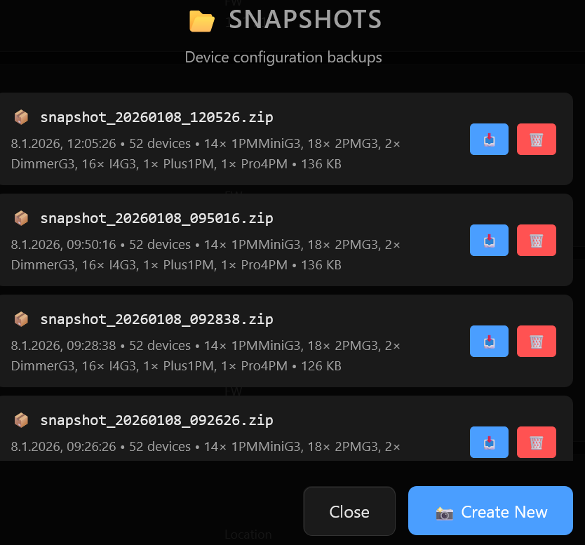

<div style="page-break-before: always;"></div>

#### 2.9.4 Generatore di rapporti

Generare rapporti di installazione professionali in formato PDF o Excel.

**Generazione di un rapporto:**

1. Aprire la pagina edificio
2. Andare alla sezione **Audit** nella barra laterale
3. Cliccare su **📊 Generatore di rapporti**
4. Configurare le opzioni del rapporto:
   - **Snapshot**: Crearne uno nuovo o selezionare uno snapshot esistente
   - **Lingua**: Lingua del rapporto (DE, EN, FR, IT, NL)
   - **Formato**: PDF o Excel (XLSX)
5. Cliccare su **Genera**

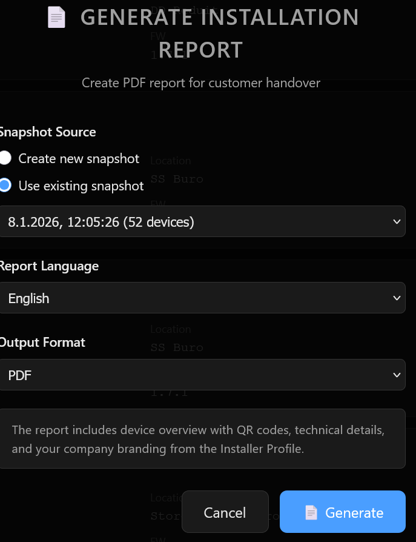

**Contenuto del rapporto PDF:**

Il rapporto PDF include:
- **Intestazione**: Logo aziendale, titolo del rapporto, data di generazione
- **Informazioni oggetto**: Nome cliente, indirizzo, dati di contatto
- **Riepilogo**: Numero totale dispositivi, stanze e tipi di dispositivi
- **Tabella dispositivi**: Inventario completo con codici QR

**Colonne della tabella dispositivi:**

| Colonna | Descrizione |
|---------|-------------|
| QR | Codice QR collegato all'interfaccia web del dispositivo |
| Stanza | Stanza assegnata |
| Posizione | Posizione nella stanza |
| Nome | Nome descrittivo del dispositivo |
| Modello | Tipo di dispositivo |
| IP | Indirizzo di rete |
| FW | Versione firmware |
| MAC | Ultimi 6 caratteri dell'indirizzo MAC |
| SWTAK | Indicatori funzionalità (vedi sotto) |

**Indicatori funzionalità (SWTAK):**

Ogni dispositivo indica quali funzionalità sono configurate:

| Indicatore | Significato | Fonte |
|------------|-------------|-------|
| **S** | Scripts | Il dispositivo ha script installati |
| **W** | Webhooks | Il dispositivo ha webhook configurati |
| **T** | Timers | Timer auto-on o auto-off attivi |
| **A** | Schedules | Automazioni pianificate configurate |
| **K** | KVS | Voci Key-Value Store presenti |

Gli indicatori attivi sono evidenziati, quelli inattivi sono in grigio.

**Rapporto Excel:**

L'esportazione Excel contiene le stesse informazioni del PDF in formato foglio di calcolo:
- Foglio di lavoro singolo con tutti i dispositivi
- Intestazione con metadati del rapporto
- Legenda che spiega gli indicatori SWTAK
- Colonne ottimizzate per il filtraggio e l'ordinamento

> **Suggerimento:** Utilizzare il formato Excel quando è necessario elaborare ulteriormente i dati o creare documentazione personalizzata.

<div style="page-break-before: always;"></div>

#### 2.9.5 Audit di configurazione

La funzione Audit confronta lo stato attuale in tempo reale di tutti i dispositivi con uno snapshot di riferimento per rilevare modifiche alla configurazione, nuovi dispositivi o dispositivi offline.

**Esecuzione di un audit:**

1. Aprire la pagina edificio
2. Andare alla sezione **Audit** nella barra laterale
3. Cliccare su **🔍 Avvia audit**
4. Selezionare uno snapshot di riferimento dal menu a tendina
5. Cliccare su **🔍 Avvia audit**

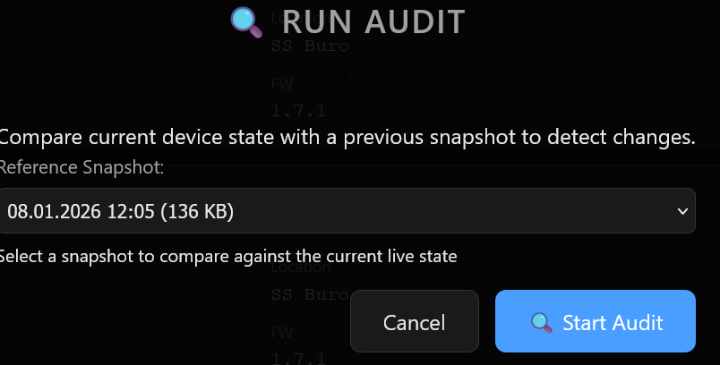

Il sistema esegue una nuova scansione di tutti i dispositivi e li confronta con lo snapshot selezionato.

**Risultati dell'audit:**

| Stato | Icona | Descrizione |
|-------|-------|-------------|
| OK | ✅ | Dispositivo invariato dallo snapshot |
| Modificato | ⚠️ | Differenze di configurazione rilevate |
| Offline | ❌ | Il dispositivo era nello snapshot ma non risponde |
| Nuovo | 🆕 | Dispositivo trovato che non era nello snapshot |

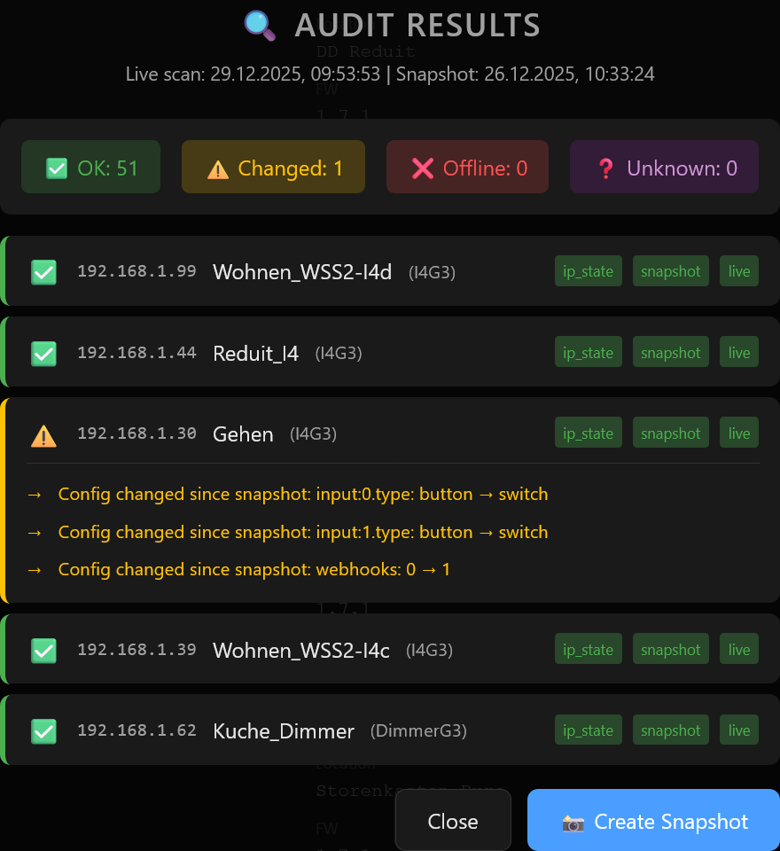

**Modifiche rilevate:**

L'audit rileva e segnala:
- Modifiche dell'indirizzo IP
- Modifiche del nome dispositivo
- Aggiornamenti firmware
- Modifiche della configurazione (tipi di ingresso, impostazioni interruttore, impostazioni tapparella)
- Modifiche delle impostazioni WiFi
- Dispositivi nuovi o mancanti

**Casi d'uso:**

- **Verifica post-installazione**: Confermare che tutti i dispositivi sono configurati come documentato
- **Controlli di manutenzione**: Rilevare modifiche inattese dall'ultima visita
- **Risoluzione problemi**: Identificare quali impostazioni sono state modificate
- **Documentazione di consegna**: Verificare che l'installazione corrisponda alle specifiche prima della consegna

> **Suggerimento:** Creare uno snapshot dopo aver completato un'installazione per utilizzarlo come riferimento per futuri audit.

<div style="page-break-before: always;"></div>

## Appendice

### A. Scorciatoie da tastiera

| Scorciatoia | Azione |
|-------------|--------|
| `Escape` | Chiudere il dialogo/modale |
| `Enter` | Confermare il dialogo |

### B. Indicatori di stato

| Icona | Significato |
|-------|-------------|
| 🟢 (verde) | Dispositivo online |
| 🔴 (rosso) | Dispositivo offline |
| S1–S4 | Fase di provisioning attuale |
| ⚡ | Aggiornamento firmware disponibile |

### C. Risoluzione problemi

**Impossibile accedere alla Web-UI:**
- Verificare la connessione Ethernet
- Verificare se la Stagebox ha un IP (lista DHCP del router o display OLED)
- Provare l'indirizzo IP direttamente invece di .local

**PIN Admin dimenticato:**
- Tenere premuto il pulsante OLED per **10+ secondi**
- Il display mostrerà «PIN RESET» e «PIN = 0000»
- Il PIN è ora reimpostato al predefinito `0000`
- Accedere con `0000` e cambiare il PIN immediatamente

**Dispositivi non trovati allo Stage 1:**
- Assicurarsi che il dispositivo sia in modalità AP (LED lampeggiante)
- Avvicinare la Stagebox al dispositivo
- Verificare la connessione dell'adattatore WiFi

**Dispositivi non trovati allo Stage 2:**
- Verificare le impostazioni dell'intervallo DHCP
- Verificare se il dispositivo è connesso al WiFi corretto
- Attendere 30 secondi dopo lo Stage 1

**Stage 4 fallisce:**
- Verificare la compatibilità del dispositivo
- Verificare che esista un profilo per il tipo di dispositivo
- Verificare che il dispositivo sia online

**Errori backup USB:**
- Rimuovere e reinserire la chiavetta USB
- Se l'errore persiste, aggiornare la pagina (Ctrl+F5)
- Assicurarsi che la chiavetta USB sia formattata per Stagebox (Admin → Formatta chiavetta USB)

**Generazione rapporto lenta:**
- Installazioni grandi (50+ dispositivi) possono richiedere 10–20 secondi
- La generazione PDF include la creazione di codici QR per ogni dispositivo
- Utilizzare il formato Excel per una generazione più rapida senza codici QR

---

*Manuale Stagebox Web-UI — Versione 1.1.0*